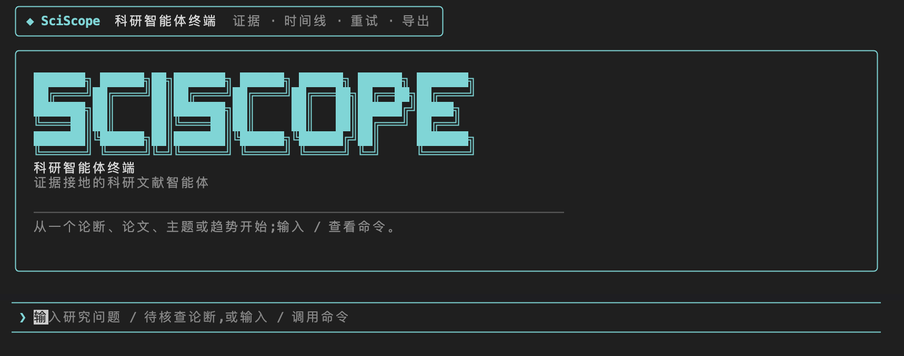

# SciScope

[](LICENSE)
[](https://www.npmjs.com/package/sciscope-tui)
[](https://github.com/Timcai06/SciScope/releases)
[](https://github.com/Timcai06/SciScope/actions/workflows/release.yml)

SciScope 是一个证据接地的科研文献智能体：用户通过跨平台终端客户端提问，
后端以文献检索、趋势分析、论文推荐、证据核查和报告资产为基础给出可追溯回答。
发布版默认连接托管后端，普通用户无需本机启动 Python、PostgreSQL 或模型服务。



## 快速开始

推荐优先使用 npm，macOS 用户也可以用 Homebrew，Windows 用户也可以用 Scoop。
完整下载索引见 [`docs/release/README.md`](docs/release/README.md)。

```bash
npm install -g sciscope-tui
sciscope-tui
```

Windows npm 用户如果遇到 GitHub Release 下载或解压失败，可暂时使用 Scoop；
npm 修复版 `0.2.2` 已在源码中准备好，等待 registry 发布。

其他安装方式：

| 场景 | 命令 | 适合谁 |
| --- | --- | --- |
| 跨平台 / 开发者 | `npm install -g sciscope-tui` | macOS、Windows、Linux；已有 Node.js 的用户 |
| macOS | `brew tap Timcai06/sciscope && brew trust --cask timcai06/sciscope/sciscope-tui && brew install --cask sciscope-tui` | Homebrew 用户 |
| Windows | `scoop bucket add sciscope https://github.com/Timcai06/scoop-sciscope && scoop install sciscope-tui` | Scoop 用户 |
| 无网络演示 | `sciscope-tui demo` | 不依赖后端的固定演示流程 |

启动后直接输入科研问题即可；也可以输入 `/` 查看命令菜单。离线演示：

```bash
sciscope-tui demo
```

开发者连接本地后端：

```bash
SCISCOPE_BACKEND=http://127.0.0.1:8000 sciscope-tui
```

## 产品边界

- Python 是底座：数据治理、RAG、检索、证据接地、Agent 工具编排都在 `backend/` 与 `src/` 体系中实现。
- Go TUI (`tui/`) 是终端客户端，不承载推理，只消费后端的 SSE 事件。
- Web 前端已从当前项目路径移除；主交互端为 Go TUI 与 FastAPI API。

仓库启动面向 Makefile，以下信息优先于旧文档口径。文档总入口见
[`docs/README.md`](docs/README.md)；日常操作以本 README、`tui/README.md`、
`docs/operations/deploy-hosted-backend.md` 和 `docs/operations/runbook.md` 为准。

## 当前环境口径

| 场景 | 后端 | 数据库 | 检索 | 用途 |
| --- | --- | --- | --- | --- |
| 生产/demo | Render Web Service | Supabase Postgres + pgvector | PostgreSQL FTS + DeepSeek evidence chat；禁用运行时本地 embedding | 用户试用、演示视频、npm/Brew/Scoop 默认入口 |
| 本地开发 | 本机 FastAPI | 本地 PostgreSQL | full hybrid lexical + semantic retrieval | 全量数据、模型实验、报告生成、agent 调试 |

生产/demo 为小样本 hosted corpus，当前约 `220 papers / 467 chunks`。本地开发环境
保留全量语料、全量向量与更重的语义检索能力。不要把 hosted free demo 描述成全量
semantic production；它是稳定公开入口，架构上可升级到更大实例后开启运行时语义检索。

## 项目结构速览

- 目标：把论文源数据变成可检索、可问答、可分析的交付资产（图表、报告、证据链）。
- 数据入口：`data/raw`（新增采集 landing zone）、`data/raw_canonical`（可审计原始底账）、`src/harvest`（采集/治理入口）。
- 服务出口：`backend/app` 的 FastAPI（搜索、趋势、推荐、Agent 流式问答）。
- 访问端：
  - 终端端：`tui/`（当前主交互端）

项目目录和运行边界见 [`docs/architecture/project_structure.md`](docs/architecture/project_structure.md)。

## 本地开发

环境要求：

- Python 3.11+
- PostgreSQL（RAG/检索链条和 `/api/search` 需要）
- Go（如运行 `make tui`）

标准启动：

```bash
make install
make backend
```

打开：

- 后端文档：`http://127.0.0.1:8000/docs`

常见开发运行路径：

- 后端：`make backend` 或 `make dev`。
- 仅 TUI：发布版直接 `sciscope-tui`；源码开发用 `make backend`（先起后端）→ `make tui`。
- 本地模型端到端：先保证可用 OpenAI-compatible 服务，再用 `make dev-vllm`。
- 离线演示：`make tui-demo`。
- TUI 体检：`make tui-doctor`。
- MCP 服务端：`make mcp`（把工具暴露给 Claude Desktop 等 MCP 客户端，详见 [`docs/developer/mcp.md`](docs/developer/mcp.md)）。

## 核心命令

### 数据层与报告

- `make raw-governance`：原始治理到 `data/raw_canonical`。
- `make analysis-assets-all`：生成 `data/analysis/*`。
- `make processed-corpus`：生成 `data/processed/papers_corpus.json`。
- `make report-figures`：生成图表资源到 `output/assets/sciscope_data_report/`。
- `make data-report-pdf`：生成 `sciscope_data_report.pdf`。
- `make project-report-pdf`：先刷新项目报告图表，再生成 `sciscope_project_report.pdf`。
- `make full-rebuild`：从分析资产开始重建入库、向量、模型、图谱与数据报告；原始治理需先跑 `make raw-governance`。
- `make data-layer-refresh`：分析资产 + 语料 + 报表重建的轻量入口。

`data/` 不是 PostgreSQL 的重复备份：它是数据库、RAG、模型、报告的可重建资产层。数据库负责在线查询服务；`data/raw_canonical`、`data/analysis`、`data/processed/papers_corpus.json`、`data/processed/paper_chunks.jsonl` 负责复现、审计与报告。

报告叙事、截图和 hosted/local 口径见 [`docs/reports/report-optimization.md`](docs/reports/report-optimization.md)。

### 模型层与工具链

- `make rag-chunks`：构建 RAG 块。
- `make postgres-load`：写入 PostgreSQL。
- `make postgres-refresh`：schema + load 的完整刷新。
- `make embeddings` / `make trend-model` / `make recommend-model` / `make graph-export`：模型/图谱资产构建。
- `make agent-build`：`embeddings + trend + recommend + graph` 聚合构建。

### 服务与验证

- `make test`：后端测试。
- `make test-backend`：仅后端测试。
- `make smoke`：基础 API 健康检查。
- `make agent-smoke`：live agent 黑盒验收，检查真实库表规模、skills 工具链路与工具预算。
- `make vllm-smoke`：检查本地 OpenAI-compatible 模型端点。
- `make tui-build TUI_VERSION=0.2.1`：产出 Go 客户端二进制。

## Terminal Agent Client（Go TUI）

终端客户端是“协议消费者”：它不承载模型与检索决策逻辑，只消费
`POST /api/agent/stream` 的 SSE 事件并渲染为可读面板。

启动方式（发布版推荐，默认连接 hosted backend）：

```bash
sciscope-tui
```

源码开发时连接本地后端：

```bash
make backend  # 先启动后端 127.0.0.1:8000
make llm      # 可选：本地 LLM 兼容网关（用于真实联网问答）
SCISCOPE_BACKEND=http://127.0.0.1:8000 make tui
make tui-demo # 离线演示流程（无后端）
make tui-doctor # 检查后端/LLM/会话目录/图谱资产
```

版本与发布链路请见：

- `tui/README.md`
- `docs/release/README.md`

## 运行时速查

默认环境变量（运行时有默认值）：

- `SCISCOPE_DATA_PATH=data/sample/papers.sample.json`
- `SCISCOPE_DB_DSN=postgresql://tim@localhost:5432/sciscope`
- `SCISCOPE_USE_MOCK_LLM=true`
- `SCISCOPE_LLM_PROVIDER=deepseek`
- `SCISCOPE_BACKEND` 仅用于 TUI 覆盖后端地址；发布二进制已内置 hosted URL。
- `SCISCOPE_ENABLE_RUNTIME_EMBEDDINGS=false` 用于小规格 hosted 服务，避免 Web 容器加载本地 embedding 模型。
- Agent 运行时：单一 LangGraph StateGraph（`backend/app/agent/langgraph_runtime.py`），无运行时开关。

关键 API：

- `POST /api/agent/stream`（SSE）：请求支持 `question/history/session_id/retry`；SSE 事件 `plan/text/tool_call/tool_result/reflect/final/error`，并在 `meta` 中返回 `runtime/node/elapsed_ms/session_id/retry`，供 TUI 渲染工具时间线与同会话 `/retry`。
- `GET /api/ingest/status`
- `GET /api/dashboard/overview`
- `POST /api/chat`

## 常见故障（先查这里）

- 端口不可达：确认 `make backend` 已启动，访问 `127.0.0.1:8000`。
- TUI 无法显示流式：确认后端先跑，再执行 `make tui`；必要时设置 `SCISCOPE_TUI_ICONS=off`。
- 检索/趋势为空：确认 PostgreSQL 已准备好，执行 `make postgres-refresh` 或至少 `make postgres-load + make rag-chunks`。
- LLM 报错：切回 `SCISCOPE_USE_MOCK_LLM=true` 做快速验证；或先 `make llm` 提供本地模型。
- 图表/PDF 缺失：检查 `data/analysis` 和 `output/assets/sciscope_data_report`，再跑 `make report-figures && make data-report-pdf`。
- 项目报告缺失或指标过期：先确认 `data/processed` 和 `output/eval` 是否为最新，再跑 `make project-report-pdf`。

## 现有边界

- 该分支的主运行路径是：Python agent/data layer 为核心，Go TUI 为终端消费端。
- Web 前端源码已移除；若未来重启 Web 界面，应作为新范围重新设计和接入。
- `data_pipeline/` 保留为 legacy sample pipeline 与旧测试兼容层；核心数据治理以 `src/harvest`、`src/analysis`、`src/infra` 为准。
- DeepSeek 是 hosted/demo 的默认云端模型；确定性本地验证仍可使用 mock 模式，本地 LLM 通路以 `make dev-vllm` / `make llm` 为主。

## 许可证与贡献

SciScope 以 Apache License 2.0 开源。欢迎围绕后端、数据/RAG 管线、Go TUI、
打包发布、文档和测试提交 issue 或 pull request；贡献入口见
[`CONTRIBUTING.md`](CONTRIBUTING.md)，安全问题请先看 [`SECURITY.md`](SECURITY.md)，
社区协作规范见 [`CODE_OF_CONDUCT.md`](CODE_OF_CONDUCT.md)。
