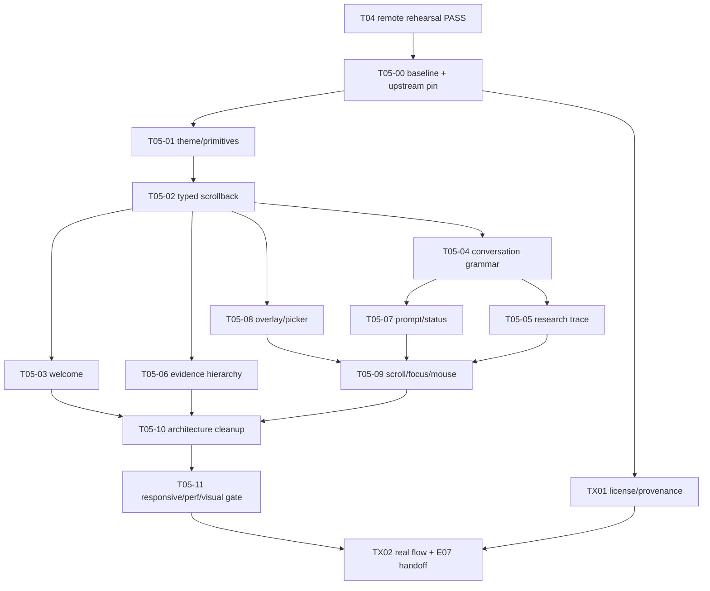

# T05｜Grok Build 对标沉浸式 TUI 重构

- 任务分配名：`T05 Grok Build 对标 TUI`
- 状态：`active`
- 负责人：`@Timcai06`
- 代码审核与最终验收：`Codex`
- 最后验证时间：`2026-08-13`
- 远端观察基线：`bc2cc4316bfd9fc41f4030059543ce6c6c505ede`（实施前由 T05-00 用实际干净 HEAD 重新冻结）
- 对应主计划：[`../T-TUI科研工作流.md`](../T-TUI科研工作流.md)
- 前置工程门禁：[`T04-20260812-远端全量演练与离线回退.md`](T04-20260812-远端全量演练与离线回退.md)
- 上游参考实现：`xai-org/grok-build` → `crates/codegen/xai-grok-pager/`
- 上游版本策略：**禁止长期跟随 floating main**；T05-00 必须固定 Git commit、`SOURCE_REV`、参考文件清单与许可证台账
- 执行原则：先冻结事实和上游对标，再重构呈现层；不改 Python Agent 内核、科研工具语义、SSE 合同和证据事实

---

## 一、交付目标

本阶段不是“给现有 TUI 换一套配色”，而是把 Grok Build 已公开的 TUI 当作**参考实现**，对 SciScope 的终端产品进行一次激进、源码级、可验证的对标重构。

我们明确接受以下方向：

> **在不复制 Grok 品牌资产、不改变 SciScope 科研事实语义的前提下，尽可能复用 Grok Build 已验证的 TUI 交互范式、信息层级、组件边界和渲染纪律。**

阶段结束后，必须可以观察到以下结果：

1. `sciscope-tui` 默认进入沉浸式黑色工作区，视觉密度、留白、灰阶层级、焦点和选中态接近 Grok Build 的产品完成度；
2. **SciScope ASCII Logo 完整保留**，但退出 Dashboard 卡片堆叠，成为启动页唯一的大型品牌视觉；
3. 主工作面从“panel/dashboard 输出器”转为 **conversation + scrollback + prompt + overlay** 的 Agent TUI；
4. 普通 plan/tool/status 事件不再全部套框，完成后的研究轨迹可折叠，答案成为主视觉；
5. Evidence、Claim Verification、Dispute、Recovery 等科研领域对象继续保留强结构表达，并成为 SciScope 相比 Grok 的核心差异；
6. Slash Command、Session、Theme、Doctor、确认菜单等统一进入可复用 Overlay/Picker 体系；
7. SSE、Session、Resume、Export、Offline Demo、结构化答案合同、证据显示授权和 fail-closed 全部保持行为等价；
8. `main.go` / `render.go` 不再继续演化为 God Model / God Renderer，呈现状态、滚动块、组件和主题有清楚所有权；
9. 80 / 120 / 160 列、中文、无 Nerd Font、Resize、Mouse/Trackpad、Streaming、Offline Demo 均有自动或人工证据；
10. 最终评委截图和录屏使用新的稳定 TUI；如果 E07 的非视觉材料已准备，可并行推进，但**最终 UI 截图/录屏不得在 T05 视觉门禁前冻结**。

本计划完成的定义不是“看起来像 Grok”，而是：

> **Grok 式成熟 TUI 语法已经成为 SciScope 自己的稳定呈现层，同时 SciScope 的 evidence-first 语义没有被模仿行为稀释。**

---

## 二、为什么现在可以激进对标

### 2.1 当前 SciScope 已经不是功能原型

T00-T04 已完成当前科研 TUI 的能力、黄金任务、结构化结果卡、依赖降级和真实远端演练。当前 TUI 已具备：

- Go + Bubble Tea + Bubbles + Lip Gloss + Glamour；
- 后端 SSE 流式事件消费；
- `/verify`、`/review`、`/trend`、`/recommend`、`/timeline`；
- `/sessions`、`/resume`、`/retry`、`/export`；
- `/doctor`、`/demo`、主题和多级 Slash Launcher；
- Evidence / Claim / Trend / Recommendation / Dispute 结构化渲染；
- `answer-contract/v1` sidecar；
- Session 持久化、失败原因保存和离线 fixture；
- Alt Screen、Mouse Cell Motion、30 FPS Bubble Tea program；
- 已有最终块缓存、viewport 和 streaming 刷新节流。

因此 T05 不再用“先把功能做出来”为理由容忍低完成度呈现。底层科研能力继续冻结，重心转向产品层。

### 2.2 Grok Build 公开源码提供了可直接审查的参考实现

T05 不只参考截图，必须阅读并对照以下上游区域：

```text
xai-org/grok-build/
└── crates/codegen/xai-grok-pager/
    ├── src/app/
    ├── src/scrollback/
    ├── src/views/
    ├── docs/user-guide/
    └── Cargo.toml
```

至少审查：

```text
src/app/actions.rs
src/app/dispatch/
src/app/effects/
src/app/event_loop.rs
src/app/app_view.rs

src/scrollback/

src/views/welcome/
src/views/prompt_widget/
src/views/modal.rs
src/views/modal_window.rs
src/views/overlay.rs
src/views/overlay_list.rs
src/views/picker.rs
src/views/completion_dropdown.rs
src/views/slash_dropdown.rs
src/views/status_bar.rs
src/views/context_bar.rs
src/views/shortcuts_bar.rs
src/views/turn_status.rs
src/views/timeline.rs
```

只读源码对标允许激进；真正移植代码必须经过 TX01 许可证门禁。

### 2.3 “激进模仿”的定义

#### 必须强对标

- Fullscreen / black canvas 的沉浸感；
- Scrollback-first 主工作面；
- Prompt 固定为底部视觉锚点；
- 事件块的灰阶、缩进、留白和极少数强调色；
- running / finished 内容的折叠语法；
- modal / overlay / picker 的统一视觉和键盘层级；
- Command Palette 的搜索、分组、选中态和底部 shortcut strip；
- scroll follow、manual scroll、resize、focus、mouse 的交互纪律；
- typed state → update → view 的清晰呈现架构；
- 组件级 snapshot / render 测试思路。

#### 允许按 SciScope 领域适配

- Grok 的 coding tool block → SciScope research tool block；
- Grok 的 turn status → SciScope Research Trace；
- Grok 的 edit/diff object → SciScope Evidence / Claim / Dispute object；
- Grok 的 context/status 元信息 → SciScope backend/session/evidence 元信息；
- Grok accent → SciScope Cyan/Teal；
- Grok welcome → 保留 SciScope ASCII Logo 的科研启动页。

#### 禁止复制

- Grok、xAI、SpaceXAI 名称、Logo、ASCII 品牌图形、营销文案；
- Grok 特有模型名、额度、升级入口或 coding-agent 业务；
- 未核对许可证来源的第三方/vendored 代码；
- 为追求像素相似而破坏 SciScope 的引用、拒答、display policy 或 provenance；
- 把 Rust/Ratatui 直接塞进 SciScope，形成第二套 TUI runtime。

---

## 三、前置门禁与当前事实

### 3.1 基线门禁

T05-00 开始任何 UI 修改前必须完成：

1. `git status --short` 为空，或所有脏修改已明确归属并形成可回退提交；
2. 记录实际 `git rev-parse HEAD`，替换本计划头部的执行基线；
3. 在 `tui/` 运行 `go test ./...`；
4. 运行 `make tui-demo` 或等价离线演示；
5. 记录 80 / 120 / 160 列基线；
6. 记录当前 Splash、普通回答、工具调用、Evidence、Evidence Insufficient、Command Palette、Session Picker、Doctor、Streaming 七类画面；
7. 固定 Grok Build 上游 Git commit 与 `SOURCE_REV`；
8. 生成一份“Grok source path → SciScope target path → 对标行为”的矩阵。

任何基线测试失败都必须先登记为既有失败，不能在 T05 后把修复或回归混在一起。

### 3.2 已确认的当前代码事实

- `tui/main.go` 同时承担 CLI、theme、model、Update、大量交互状态和启动组合；
- `tui/render.go` 同时承担 Splash、Command Palette、Timeline、Plan、Tool Result、Evidence、Claim、Answer Contract 等大量呈现；
- `model` 已包含 viewport、textinput、spinner、blocks、blockItems、transcript cache、answer、timeline、session、menu/submenu、stream state 等；
- 当前 `conversationBlock` 已有最小渲染缓存，因此不需要推倒重来；T05 应把它升级为 typed scrollback authority；
- 当前 Splash 明确定义为 Quick Actions / System Status / Golden Demo / Recent Work Dashboard；
- 当前 `panelRow(kind, title, meta, body)` 是大量事件的统一容器，边框语义过宽；
- 当前 Command Palette 已有过滤、分类、selection、submenu，因此任务是重构 presentation 和 state seam，不是重新发明命令系统；
- 当前 program 已经使用 `tea.WithAltScreen()`、`tea.WithMouseCellMotion()` 和 `tea.WithFPS(30)`，**T05 不得把已有能力包装成新完成项**；
- 当前最终回答已经按 width 做 Glamour render，并缓存 finalized blocks；优化必须保持缓存收益；
- 当前 Nerd Font 图标可通过 `SCISCOPE_TUI_ICONS=off` 关闭，但默认仍依赖 PUA 图形；T05 改为普通 Unicode 为默认、Nerd Font 为增强模式。

### 3.3 当前主要缺口

1. **Dashboard 感强于 Agent 感**：启动页和大量 panelRow 把 TUI 做成了“终端仪表盘”。
2. **边框没有对象语义**：plan、tool call、tool result、timeline、recovery、evidence 都可以被同一种框包住，视觉层级不清楚。
3. **Scrollback 仍偏字符串拼接**：缺少稳定 Block Identity、折叠态、运行态、完成态和选择态的统一模型。
4. **Research Trace 没有主次收敛**：执行过程可以看，但完成后仍容易与答案争抢注意力。
5. **Command Palette 有功能但不像 Overlay 系统**：列式布局信息过密，palette、submenu、sessions、doctor、confirm 未形成统一 modal grammar。
6. **颜色角色过多**：user/tool/accent/warn/error 等并行使用，破坏纯黑画布下的克制感。
7. **Answer Contract 太像 debug sidecar**：协议字段有价值，但默认视觉权重过高。
8. **Nerd Font 默认依赖不利于跨终端一致性**。
9. **文件职责开始膨胀**：继续直接向 `main.go` / `render.go` 加功能会使下一轮维护成本陡增。
10. **缺少“源码对标证据”**：当前审美判断主要靠经验和截图，T05 必须把 Grok 源码结构与行为映射固化为可复核证据。

---

## 四、范围与非目标

### 4.1 本阶段范围

- TUI theme/design tokens；
- Splash / Welcome；
- Scrollback state 和 Conversation View；
- Research Trace / Turn Status；
- User / Assistant / Plan / Tool / Evidence / Recovery block grammar；
- Evidence / Verify / Dispute / Recommendation / Trend 的视觉层级；
- Prompt / Composer / Status / Shortcuts；
- Command Palette / Modal / Picker / Submenu；
- Mouse / Keyboard / Resize / Follow / Focus；
- Responsive width；
- 渲染缓存、streaming 节流和 performance regression；
- TUI 代码拆分；
- 视觉快照、Golden Demo、真实 SSE 回归；
- TUI README / 产品截图 / E07 UI 材料更新；
- 如发生直接源码移植，许可证、NOTICE 和 provenance 记录。

### 4.2 非目标

- 不改 Python Agent Loop；
- 不改 Retrieval / Reranker / Stance / Evidence Judge；
- 不改现有 SSE 事件协议，除非发现 UI 无法表达的真实协议缺口并单独立项；
- 不改数据库、向量索引和 MCP 业务语义；
- 不新增“为了像 Grok”而虚构的 Agent 能力；
- 不实现 Grok 的 Coding Tools、Worktree、Plan Approval、Plugin Marketplace、Model Picker 等无 SciScope 需求的业务；
- 不将 Bubble Tea 重写为 Rust/Ratatui；
- 不引入大型 TUI framework 或第二套 render loop；
- 不在本阶段建立完整用户配置文件系统；
- 不为了视觉统一隐藏 evidence insufficient、dependency failure、unauthorized evidence 或 contradictory evidence；
- 不把 T05 自动化截图称为真人评委验收。

---

## 五、目标视觉与交互宪法

### 5.1 黑色沉浸画布

Dark 为默认主体验：

```text
Canvas       #000000
Surface      #080A0A
SurfaceHover #111414
Ink          #E7E7E7
Muted        #8A8F8F
Faint        #505555
Border       #292D2D
Accent       #5FD7D7
AccentSoft   #214646
Warning      #D7AF5F
Error        #FF7777
```

颜色纪律：

```text
约 90%  Ink / Gray
约 7%   SciScope Accent
约 2%   Warning
约 1%   Error
```

颜色必须表达状态，而不是装饰角色：

- Accent：focus / active / selected / trusted evidence emphasis；
- Warning：evidence insufficient / uncertainty / degraded；
- Error：真实执行失败；
- 普通 Tool / User / Assistant 不再各拥有一套高饱和角色色。

`paper`、`light`、`contrast` 主题继续兼容，但 T05 的视觉金标准只以 `dark` 为主，其他主题必须行为等价、不要求像素同构。

### 5.2 ASCII Logo 保留规则

ASCII Logo 是 SciScope 的品牌资产，**不得删除**：

```text
>= 86 cols   完整六行 SciScope ASCII Logo
60–85 cols   紧凑 wordmark / compact ASCII
< 60 cols    文本 SciScope
```

完整 Logo 只在空会话 Welcome 中作为大型视觉出现。进入对话后不重复占屏。

Splash 删除外层大 Card 和三栏 Dashboard，不再同时堆 Quick Actions / System Status / Golden Demo 三块大面板。

### 5.3 Border Budget

默认**无框**：

- User prompt；
- Researching / Research plan；
- Tool call / tool summary；
- Normal assistant answer；
- Timeline summary；
- Status / shortcuts。

允许完整边框：

- Evidence detail；
- Claim Verification detail；
- Dispute detail；
- 必须阻断用户行动的 Recovery / Permission-like state；
- Modal / Overlay / Picker。

规则：

> **边框代表“一个需要独立审阅的领域对象或交互表面”，不是默认排版工具。**

### 5.4 主界面心智模型

```text
┌──────────────────────────────────────────────────────────────┐
│ scrollback / conversation                                    │
│                                                              │
│ ❯ 用户问题                                                   │
│                                                              │
│ ◆ Researching · 6.8s                                        │
│   ✓ Search literature                    12 papers            │
│   ◆ Verify evidence                      4 / 12               │
│                                                              │
│ Strong support                                               │
│ 研究结论正文……                                                │
│                                                              │
│ ╭─ Evidence 01 ────────────────────────────────────────────╮ │
│ │ ...                                                     │ │
│ ╰─────────────────────────────────────────────────────────╯ │
│                                                              │
├──────────────────────────────────────────────────────────────┤
│ ❯ 输入研究问题、待核查论断，或输入 /                         │
│ / commands                             hosted · ready          │
└──────────────────────────────────────────────────────────────┘
```

这只是信息层级，不要求用 ASCII 复刻 GUI。

### 5.5 Research Trace 规则

运行时：

```text
◆ Researching · 6.8s

  ✓ Understand claim
  ✓ Search literature             12 papers
  ◆ Verify evidence               4 / 12
  ○ Synthesize
```

完成后默认：

```text
◆ Researched for 11.4s · 4 tools · 12 papers
```

用户展开后再看详细步骤。`/timeline` 继续提供完整审计时间线。

“思考过程”统一改为“研究计划 / Research plan”，只展示可审计执行计划和工具轨迹，不声称展示模型私有 Chain of Thought。

### 5.6 Evidence 是 SciScope 的例外

Grok 的“少框”原则不能机械套到 Evidence。

Evidence / Claim / Dispute 必须比普通 Agent event 更结构化：

```text
╭─ Evidence 01 ─────────────────────────────────────╮
│ Retrieval-Augmented Generation for...             │
│ Lewis et al. · 2020                               │
│                                                   │
│ SUPPORTS                               0.91       │
│                                                   │
│ “...”                                             │
│                                                   │
│ abstract · chunk 91a82c41                         │
╰───────────────────────────────────────────────────╯
```

并且：

- contradictory evidence 与 supporting evidence 视觉权重相当；
- evidence insufficient 使用 Warning，不使用伪成功绿；
- display policy 禁止显示正文时必须继续隐藏；
- provenance / source / chunk 是审计信息，不是装饰；
- answer contract 默认压缩成 answer header/footer，详细字段不丢失。

---

## 六、Grok → SciScope 源码对标矩阵

| Grok Build 参考区域 | 当前 SciScope 对应 | T05 目标 | 任务 |
|---|---|---|---|
| `src/app/actions.rs`、`dispatch/`、`effects/`、`event_loop.rs` | Bubble Tea `Msg` / `Update` / `tea.Cmd` 主要集中于 `main.go` | 不复制 Elm 实现，但拆清 Action/Event、Effect/Cmd、View State 所有权 | T05-02 / T05-10 |
| `src/scrollback/` | `blocks`、`blockItems`、viewport、cache | Typed block identity、running/finished/folded/expanded/follow 状态 | T05-02 / T05-04 |
| `src/views/welcome/` | `renderSplash` + Dashboard | 保留 ASCII Logo，删除 Dashboard 卡片堆叠 | T05-03 |
| `src/views/prompt_widget/` | `textinput.Model` | Grok 式底部 composer、focus/collapse、低权重 shortcut | T05-07 |
| `modal.rs` / `overlay.rs` / `picker.rs` | Command Palette + submenu 字符串渲染 | 统一 Overlay/Picker state 和 render primitive | T05-08 |
| `slash_dropdown.rs` / `completion_dropdown.rs` | `/` launcher + filter | 搜索、分组、selection、usage 的现代列表语法 | T05-08 |
| `status_bar.rs` / `context_bar.rs` / `shortcuts_bar.rs` | 分散 status / hints | 一条低视觉权重 status + shortcut strip | T05-07 |
| `turn_status.rs` / `timeline.rs` | workflow status + `/timeline` | 主界面 compact Research Trace；完整 `/timeline` 不变 | T05-05 |
| Pager appearance / scrollback config | theme map、FPS、viewport wheel | 复用 30 FPS/AltScreen，补 fold/follow/focus/scroll discipline | T05-01 / T05-09 |
| Snapshot / view tests | `main_test.go` 大量行为测试 | 分组件 render snapshot + state transition + width matrix | T05-11 |

T05-00 必须把这张表扩展到**实际阅读过的上游文件**。未读源码不得写成“Grok 就是这样实现的”。

---

## 七、原子任务总表

| 任务 | 状态 | 依赖 | 可并行性 | 核心交付 |
|---|---|---|---|---|
| T05-00 事实冻结与上游 pin | `DONE（待复核）` | T04 PASS | 串行 | SciScope clean baseline、Grok commit/SOURCE_REV、截图、测试、源码映射、许可证台账 |
| T05-01 Theme 与呈现 primitive | `DONE（待复核）` | T05-00 | 串行 | black canvas、token、spacing、border budget、Unicode icon policy |
| T05-02 Typed Scrollback 状态层 | `DONE（待复核）` | T05-01 | 串行 | block identity、status/fold/cache、ViewState seam，停止 string-only 扩张 |
| T05-03 Welcome / ASCII 启动页 | `DONE（待复核）` | T05-01,T05-02 | 可与 T05-06 逻辑并行 | 无 Dashboard 的沉浸式 Welcome，响应式 ASCII Logo |
| T05-04 Conversation / Block Grammar | `DONE（待复核）` | T05-02 | 主写串行 | user/plan/tool/assistant 的 Grok 式无框 scrollback、group/fold |
| T05-05 Research Trace | `DONE（待复核）` | T05-04 | 串行 | running 展开、finished 折叠、`/timeline` 完整保留 |
| T05-06 Evidence / Answer Hierarchy | `DONE（待复核）` | T05-02,T02,A02 | 可与 T05-03 逻辑并行 | Evidence/Claim/Dispute 卡、insufficient、contract 降权 |
| T05-07 Prompt / Status / Shortcuts | `DONE（待复核）` | T05-04 | 可与 T05-08 并行（文件隔离后） | composer、focus、status、hint strip |
| T05-08 Overlay / Picker / Command Palette | `DONE（待复核）` | T05-02 | 可与 T05-07 并行（文件隔离后） | 通用 overlay + launcher/session/theme/tools/doctor/confirm |
| T05-09 Scroll / Focus / Mouse / Resize | `PENDING` | T05-04,T05-07,T05-08 | 串行集成 | follow/manual fold、resize anchoring、trackpad、发送后 viewport 行为 |
| T05-10 文件职责收敛 | `PENDING` | T05-03~09 行为稳定 | 串行 | `main.go` composition root 化、render/view/test 拆分 |
| T05-11 响应式、性能与视觉回归 | `PENDING` | T05-03~10 | 可并行只读验证 | 80/120/160、ANSI/Unicode、benchmark、golden render、PTY/手工矩阵 |
| TX01 上游许可证与 provenance 审计 | `PENDING` | 全程 | 可并行只读 | 所有直接 port 代码的来源、commit、LICENSE/NOTICE 合规 |
| TX02 真实 SSE / Demo / E07 收口 | `PENDING` | T05-11,TX01 | 串行 | demo + online smoke、before/after、README、评委截图/录屏、归档证据 |

---

## 八、原子任务详细定义

### T05-00｜事实冻结与 Grok 上游参考基线

**目标**：让后续每一笔“像 Grok”的修改都能回答“参考了哪个公开源码版本、当前 SciScope 原行为是什么”。

**文件边界**：只读 `tui/**`、T 计划文档、Grok Build 上游；只允许写本任务的基线/证据文档，不改运行代码。

**必须完成**：

1. 记录 SciScope clean HEAD、Go version、OS、terminal、窗口列宽；
2. `cd tui && go test ./...`；
3. `make tui-demo` 或等价命令；
4. 生成当前 80 / 120 / 160 cols 的文本/截图基线；
5. 固定 Grok Build Git commit 和根 `SOURCE_REV`；
6. 阅读本计划第六节列出的上游路径，不只看 README；
7. 记录每项对标为 `copy behavior`、`adapt behavior`、`do not copy`；
8. 记录 Apache-2.0 first-party 与 third-party notice 边界；
9. 记录当前 `main.go`、`render.go`、测试文件行数和 `go test` 时间；
10. 不允许先写 UI 再倒推基线。

**验收**：任意 Reviewer 可从记录重现当前 SciScope 与固定 Grok 上游的对照。

**验证证据**：HEAD、SOURCE_REV、命令日志、截图、source map、license map。

---

### T05-01｜Theme、Design Token 与 Render Primitive

**目标**：先冻结“黑、灰、青、黄、红”的视觉法则，再改组件，禁止每个组件自行选颜色和 Border。

**建议文件**：

```text
tui/theme.go
tui/style_primitives.go
```

如果暂不拆包，保持 `package main`，不要为了目录漂亮先制造 Go package API。

**做什么**：

- 把 theme 定义从 `main.go` 抽离；
- Dark 使用本计划 token；
- 定义 `PrimaryText / MutedText / FaintText / AccentText / WarningText / ErrorText`；
- 定义 spacing / indent / separator / selected row / overlay border primitive；
- 定义 `DomainCard` 与普通 `InlineBlock` 两种明确等级；
- 默认 `useIcons=false`，普通 Unicode 为 canonical；Nerd Font 作为 opt-in enhancement；
- 保持 `paper/light/contrast` 行为，不要求视觉主张与 Dark 一致。

**禁止**：在本任务重写 Evidence、Splash 或 Palette 业务。

**验收**：新增组件不需要直接引用散落 hex；现有 visual test 可逐步迁移但行为不变。

---

### T05-02｜Typed Scrollback 与 View State

**目标**：建立后续折叠、grouping、sticky/follow 和 overlay 不再依赖字符串猜测的状态层。

**核心原则**：

> `transcript` 是持久/导出事实；`scrollback block` 是 UI 投影；两者不得互相成为第二事实源。

**建议模型**：

```go
type BlockKind string

type ScrollbackBlock struct {
    ID        string
    Kind      BlockKind
    Status    BlockStatus
    Expanded  bool
    StartedAt time.Time
    EndedAt   time.Time
    Raw       any
    Rendered  string
    Width     int
    Version   int
}
```

实际字段以现有类型为准，不强制照抄。

至少表达：

- user；
- research_plan；
- tool_group / tool_result；
- research_trace；
- evidence；
- answer；
- contract；
- recovery；
- system。

**必须证明**：

- streaming 更新同一 running block，而非无限 append；
- finished block 可缓存；
- fold/unfold 不修改 transcript；
- width 改变只失效相关 render cache；
- `/export`、`/resume` 仍以原事实语义工作。

**验收**：后续 T05-04/05/06 不再靠解析 ANSI/标题文本判断块类型。

---

### T05-03｜Welcome 与 ASCII 启动仪式

**目标**：保留品牌冲击力，删除 Dashboard 产品气质。

**目标层级**：

```text
[ASCII SciScope]

Research with evidence / 证据接地的科研智能体

/verify   /review   /trend

Recent
› last session

❯ composer
```

**必须删除/降权**：

- 三栏 Quick Actions / System Status / Golden Demo；
- Splash 外围大型 Rounded Card；
- 启动页上永久 Backend/LLM status；详细状态只由 `/doctor` 负责。

**必须保留**：

- full ASCII Logo；
- Recent Session；
- `/demo` 可发现性；
- narrow width fallback；
- hosted/local backend 真实状态不能伪造。

**验收**：80 / 120 / 160 cols 均无断裂；宽屏第一视觉是 Logo，第二视觉是 composer，而不是 Dashboard。

---

### T05-04｜Conversation 与 Block Grammar

**目标**：建立最接近 Grok Build 的主工作面。

**规则**：

- user prompt：无框、强定位；
- plan：无框、缩进；
- tool call：无框；
- 连续 research tools 允许语义 grouping；
- tool result：默认摘要，Evidence 等对象例外；
- assistant answer：无外围 Card；
- ordinary metadata：faint；
- running block：允许 animated accent；
- finished block：默认安静；
- 重要 object：按 DomainCard 渲染。

**发送行为候选**：优先验证 Grok 式“发送后把当前 prompt 锚到 viewport 上方，让本轮 response 拥有干净页面”的体验；如果破坏人工滚动或窄屏，应保留 feature gate，不允许未经验证直接锁死。

**验收**：同一 golden demo 中，边框数量显著下降，答案和 Evidence 成为视觉主体；工具过程仍可审计。

---

### T05-05｜Research Trace 与折叠

**目标**：让“Agent 在做什么”始终可见，但完成后不抢答案注意力。

**运行态**：展开显示阶段、工具、计数和 duration。

**完成态**：收敛为一行：

```text
◆ Researched for 11.4s · 4 tools · 12 papers
```

**折叠要求**：

- Enter/Space 或统一 keymap 展开；
- running block 默认展开；
- finished block 默认折叠；
- manual fold 在本轮 streaming 中不被无条件覆盖；
- `/timeline` 仍返回完整执行时间线；
- `Research plan` 取代“思考过程”。

**非目标**：不输出或保存模型私有 chain-of-thought。

**验收**：完成回答后的首屏能优先看到结论，而不是 workflow engine。

---

### T05-06｜Evidence、Claim 与 Answer Contract 层级

**目标**：借 Grok 的克制提高 SciScope 自己的差异化，而不是把 Evidence 也扁平化。

**Evidence Card 必须表达**：

- Title；
- Year / Author / PaperID（按可用数据）；
- Stance；
- Confidence / Similarity（不混淆两者）；
- EvidenceSentence（仅 display policy 允许时）；
- SourceField；
- ChunkUID / provenance；
- hidden reason / insufficient reason。

**Answer Contract**：

默认：

```text
Strong support · 4 evidence · citations verified
```

详细 contract 字段进入 expandable detail 或 `/timeline`，不删除 schema。

**Evidence Insufficient**：

- Warning，而不是 Error；
- 文案明确“系统拒绝无证据结论”；
- 不显示假 confidence；
- 依赖失败与证据不足继续区分。

**验收**：T02/A02 的所有 fail-closed 测试继续通过；视觉上 supporting / contradicting / insufficient 均不被伪装。

---

### T05-07｜Prompt、Status 与 Shortcut Strip

**目标**：让底部 composer 成为稳定交互锚点。

**目标**：

```text
❯ 输入研究问题、待核查论断，或输入 /

/ commands                         hosted · ready
```

**做什么**：

- composer 占主宽度；
- focus 时 accent，仅焦点处有强颜色；
- scrollback 聚焦时可压缩非必要 hint；
- status 只保留用户下一步真正需要的信息；
- backend/session/theme/tool 等详情由 `/doctor`、`/sessions`、`/theme`、`/tools` 承担；
- shortcut strip 不超过一行，窄屏自动裁剪；
- multiline/history 是否增加快捷键，先做现有 keymap 冲突表，禁止拍脑袋绑定。

**验收**：用户无需找输入框；streaming、modal、scrollback focus 三种状态下焦点均清楚。

---

### T05-08｜Overlay / Picker / Command Palette

**目标**：把当前多级字符串菜单提升为统一可复用交互层。

**建议 primitive**：

```text
OverlayState
PickerItem
PickerSection
PickerSelection
OverlayFooter
```

不要照抄 Rust 类型名，按 Go/Bubble Tea 习惯实现。

**统一承载**：

- Slash Commands；
- Theme；
- Sessions / Resume；
- Tools；
- Doctor detail；
- Clear / Quit confirm。

**Command Palette 目标**：

```text
              Commands
┌──────────────────────────────────────────────┐
│ search: ver█                                 │
├──────────────────────────────────────────────┤
│ Research                                     │
│ › Verify claim              /verify          │
│   Literature review         /review          │
│   Research trends           /trend           │
│                                              │
│ Evidence                                     │
│   Timeline                  /timeline        │
├──────────────────────────────────────────────┤
│ ↑↓ navigate   Enter select   Esc close       │
└──────────────────────────────────────────────┘
```

**规则**：

- modal 可以用边框；
- background 不需要模拟 Web blur；
- selected row 使用 AccentSoft / marker，不用刺眼全反色；
- category + title + shortcut 优先；长描述放第二行或详情，不做六列 terminal table；
- Esc：子 picker → 父 picker → close，层级确定；
- resize 后 modal 重新居中且不越界。

**验收**：所有二级菜单共享一套 navigation / focus / Esc 语义。

---

### T05-09｜Scroll、Follow、Focus、Mouse 与 Resize

**目标**：让终端交互“像应用”，而不是只在静态截图里好看。

**必须覆盖**：

- streaming follow bottom；
- manual scroll 后停止强制跳底；
- 滚到底部后恢复 follow；
- folding 时保持当前 block anchoring；
- resize 时尽可能保持语义位置，不直接跳到随机行；
- trackpad / wheel；
- mouse hover 只用于真正 clickable surface；
- modal open 时 scrollback 不偷焦点；
- Esc / Tab / ↑↓ / Enter 的优先级确定；
- 输入过程中普通字母不得误触 scrollback shortcut。

**当前已有** `MouseWheelDelta`、AltScreen、MouseCellMotion、FPS，不得重复造底层。

**验收**：连续 streaming + 手工上滚 + resize + overlay 开关的组合场景无跳屏和输入丢失。

---

### T05-10｜文件职责与 God Renderer 收敛

**目标**：行为稳定后才拆文件，避免先“架构美容”后失去可比较基线。

优先采用同 package 多文件拆分：

```text
tui/
├── main.go                  # CLI + composition root
├── model.go                 # top-level model
├── update.go                # Bubble Tea update routing
├── keymap.go
├── theme.go
├── scrollback.go
├── view_welcome.go
├── view_conversation.go
├── view_trace.go
├── view_evidence.go
├── view_overlay.go
├── view_composer.go
├── render_primitives.go
└── ..._test.go
```

只有出现稳定复用 API 后再考虑 `internal/` package；禁止为了目录结构提前制造 package 循环和 exported symbol。

**门禁**：

- `main.go` 不再承载大段 Evidence/Palette renderer；
- `render.go` 不再是所有 object 的唯一 dump 文件；
- 每个 view 文件有单一视觉职责；
- test 跟随 view 拆分；
- 不机械搬文件制造巨型无语义 diff。

---

### T05-11｜响应式、性能、视觉回归与 Terminal Matrix

**自动宽度矩阵**：

```text
56 / 60 / 80 / 120 / 160 cols
```

其中 80 / 120 / 160 为正式截图门禁，56 / 60 用于极限 fallback。

**必须验证内容**：

- ASCII Logo；
- 中文宽字符；
- 普通 Unicode icon；
- Nerd Font off；
- Markdown；
- Evidence sentence；
- long paper title；
- long command description；
- modal；
- resize；
- streaming cache。

**性能预算**：先在 T05-00 建 baseline，再执行：

| 指标 | 门禁 |
|---|---|
| 30 FPS render loop | 不改变现有 30 FPS 上限，禁止无意义更高频刷新 |
| stream event → 可见刷新 | p95 ≤ 120 ms，且不劣于基线 20% 以上 |
| cached finalized block render | 不重新运行 Glamour；cache hit 有测试或 benchmark 证据 |
| 500 finalized blocks + 1 running block | 键盘输入和滚动无明显卡顿；自动 benchmark 相比 baseline 不退化 >20% |
| resize 120→80→160 | 无 panic、无持久 broken layout、无 block identity 丢失 |
| modal filter 100 items | 输入响应 p95 ≤ 50 ms（固定本地 fixture） |

如果 CI 机器抖动导致绝对 p95 不稳定，以固定 benchmark 的相对回归为 blocking gate，真实终端人工体验单独记录。

**Terminal matrix**：

- macOS Terminal / iTerm2 / VS Code Terminal：至少人工完成主流程；
- Warp：如当前开发环境可用，执行主流程；
- Windows Terminal：至少完成 build + fixed-width render test；有真实 Windows 环境时再记录人工视觉证据；
- `TERM=dumb` 或无 truecolor：必须 fail gracefully，不得输出控制字符垃圾。

---

### TX01｜上游许可证与源码 Provenance 审计

**目标**：允许大胆学源码，但不让“开源”变成“随便复制”。

每个直接 port 的非平凡实现必须记录：

```text
upstream repo
upstream commit
SOURCE_REV
source path
license
third-party notice status
SciScope target path
port/adaptation summary
```

规则：

1. 行为级重实现优先；
2. 如果直接移植 Grok first-party Apache-2.0 代码，保留适用的版权/许可证要求并记录修改；
3. 如果来源位于 Grok third-party / vendored / ported 区域，必须继续追溯原始许可证，不能只看 Grok 根 LICENSE；
4. 不复制 Grok 品牌资产和产品文案；
5. 最终仓库如需要 NOTICE / attribution 更新，TX01 在 TX02 前完成。

**验收**：Reviewer 可以从任意“直接 port”实现反查来源；没有来源不明代码。

---

### TX02｜真实链路、Demo、文档与 E07 收口

**目标**：证明新的 UI 不是 snapshot-only redesign。

**必须运行**：

```bash
cd tui
go test ./...
```

以及项目现有等价门禁：

```text
make tui-build
make tui-demo
make tui-doctor
make tui-export-last
```

若 hosted / canonical backend 可用：

- 运行一条 `/verify`；
- 运行一条 evidence insufficient / rejection fixture；
- 至少一条 trend/review 或 recommendation；
- 完成 session save → quit → resume；
- overlay / command palette 全流程；
- streaming 期间 manual scroll / resize。

**产物**：

```text
output/evidence/t05/
├── baseline/
├── upstream-map/
├── screenshots/
├── render-tests/
├── performance/
├── terminal-matrix/
├── license/
└── final/
```

最终更新：

- `tui/README.md`；
- `docs/assets/sciscope-tui-product.png` 或替代正式截图；
- `docs/assets/tui-product-snapshot.svg` 若其仍作为文档资产；
- `docs/plan/active/T-TUI科研工作流.md` 的 T05 状态；
- E07 最终截图/录屏索引。

离线 Demo 只能证明 UI/事件投影稳定，不能替代真实 backend/LLM/数据库能力证明。

---

## 九、最简依赖图



---

## 十、并行工作树与文件租约

T05 可以并行，但**不能在当前 `main.go` / `render.go` 尚未拆 seam 前粗暴开四个 Agent 同改两个大文件**。

### 10.1 推荐执行波次

#### Wave A｜必须串行

```text
T05-00 → T05-01 → T05-02
```

先冻结事实、theme 和 typed scrollback seam。

#### Wave B｜可并行

当 T05-02 已形成独立文件后：

- Branch A：T05-03 Welcome；
- Branch B：T05-06 Evidence；
- Branch C：T05-08 Overlay；
- 主线：T05-04 Conversation。

每条 branch 必须有独立文件租约，不允许同时编辑同一个核心文件。

#### Wave C｜半并行

- T05-05 Trace；
- T05-07 Composer / Status；
- T05-08 Overlay 后续；

T05-09 负责统一交互集成，必须串行收口。

#### Wave D｜串行收尾

```text
T05-10 → T05-11 → TX02
```

TX01 全程只读并行，发现许可证问题立即阻断相关 port。

### 10.2 文件租约规则

每个写任务开始前记录：

```text
HEAD
git status --short
target files
allowed tests
```

每个写任务结束：

```text
go test <affected packages>
git diff --check
git status --short
```

并形成一个可解释、可回退提交后再释放文件。

共享 seam 只能由排在前面的任务唯一接线。后续任务在已提交 seam 上适配，不保留多份未提交“大版本”人工拼接。

---

## 十一、建议文件所有权

| 责任 | 建议文件 |
|---|---|
| CLI / Program Composition | `tui/main.go`，最终只保留 CLI、model init、`tea.NewProgram`、Run |
| Model / Update | `tui/model.go`、`tui/update.go` |
| Keymap / Focus | `tui/keymap.go` |
| Theme / Tokens | `tui/theme.go`、`tui/render_primitives.go` |
| Scrollback State | `tui/scrollback.go` |
| Welcome | `tui/view_welcome.go` |
| Conversation | `tui/view_conversation.go` |
| Research Trace | `tui/view_trace.go` |
| Evidence / Claim / Contract | `tui/view_evidence.go` |
| Overlay / Picker | `tui/view_overlay.go` |
| Composer / Status | `tui/view_composer.go` |
| SSE | `tui/stream.go`，T05 只消费、不改协议 |
| Slash Registry | `tui/slash.go`，只做命令事实，不承载视觉布局 |
| Contracts | `tui/contracts.go`，不把 display policy 搬到 view 层重新解释 |
| Demo / Doctor | `tui/doctor_demo.go`，只适配新 view state |
| Tests | 跟随 view / state 拆分，不继续只堆 `main_test.go` |

单个 View 文件明显超过约 500–600 行时评审职责，不强制机械按行数拆，但必须解释为什么仍是单一职责。

---

## 十二、测试与证据矩阵

| 层级 | 必须证明 |
|---|---|
| State Unit | block lifecycle、fold/unfold、follow、focus、overlay stack、Esc hierarchy、selection |
| Render Unit | Welcome、User、Trace、Evidence、Insufficient、Answer、Status、Palette 在固定 width 的 ANSI-normalized 输出 |
| Contract | A02 answer contract、display policy、stance、unavailable/degraded/fail-closed 不因 View 重构改变 |
| Integration | SSE event → typed block → View；Session save/resume/export；Demo event → same projection |
| Interaction | streaming + scroll、modal + resize、composer focus、submenu back、mouse wheel |
| Responsive | 56/60/80/120/160 cols；中文宽字符；长标题；无 Nerd Font |
| Performance | finalized cache、500 blocks、streaming refresh、palette filter、resize |
| Compatibility | dark/paper/light/contrast；truecolor/no truecolor；Mac/VSCode/Windows build |
| Human | 至少一次真实问题、一次 evidence insufficient、一次 session resume、一次 command palette 全流程 |
| License | 直接 port 代码完整 upstream provenance；third-party notices 无遗漏 |

自动 render snapshot 不得替代真实终端人工查看；人工截图不得替代 Go tests。

---

## 十三、视觉验收清单

### Welcome

- [ ] 宽屏完整 ASCII Logo 保留；
- [ ] 纯黑主画布；
- [ ] 无三栏 Dashboard；
- [ ] 无包住整个 Splash 的巨大 Card；
- [ ] recent session 可发现但不抢主视觉；
- [ ] composer 是第二视觉锚点。

### Conversation

- [ ] user / plan / tool / answer 普通块默认无框；
- [ ] running 状态有清楚 accent；
- [ ] finished trace 默认折叠；
- [ ] answer 比 trace 更显眼；
- [ ] metadata 大多使用 gray/faint；
- [ ] 一屏不出现无意义彩虹色。

### Evidence

- [ ] Evidence Card 是强领域对象；
- [ ] supporting / contradicting / insufficient 语义真实；
- [ ] confidence 与 similarity 不混淆；
- [ ] display-policy blocked 文本不泄漏；
- [ ] provenance 可追溯；
- [ ] contract 默认降权但可审计。

### Overlay

- [ ] Command Palette 真正居中/聚焦；
- [ ] section、selection、shortcut 清楚；
- [ ] Esc 层级一致；
- [ ] Theme / Session / Doctor / Confirm 共用 grammar；
- [ ] 80 cols 不越界。

### Composer / Status

- [ ] 输入框始终容易找到；
- [ ] focused / unfocused 状态明确；
- [ ] status 不变成系统监控面板；
- [ ] shortcut ≤ 一行；
- [ ] streaming 时输入不被重绘卡住。

---

## 十四、性能与稳定性预算

| 项目 | 目标 |
|---|---|
| Render FPS | 延续 30 FPS，不通过高 FPS 掩盖低效 View |
| SSE 视觉延迟 | p95 ≤ 120 ms，且相对 baseline 不退化 >20% |
| Finalized block | 宽度和版本未变时命中 cache，不重复 Markdown 高成本 render |
| Palette filter | 100 项 fixture p95 ≤ 50 ms |
| Large scrollback | 500 finalized blocks + 1 running，无持续性输入卡顿 |
| Resize | 连续 80↔120↔160 无 panic / 状态丢失 |
| Session | save/resume/export 行为与 T04 前一致 |
| Demo | 完整 fixture 可播放，无 event drop |

任何为了“像 Grok”新增的动画，如果使输入或 SSE 可见延迟明显退化，优先删除动画而不是提高刷新频率。

---

## 十五、提交策略

推荐主分支：

```text
feat/tui-grok-alignment
```

推荐可回退提交：

```text
chore(tui): freeze grok-build reference and visual baseline
refactor(tui): centralize dark theme and render primitives
refactor(tui): introduce typed scrollback state
feat(tui): redesign immersive ascii welcome
feat(tui): align conversation block grammar
feat(tui): add collapsible research trace
feat(tui): refine evidence-first answer hierarchy
feat(tui): redesign composer and status strip
feat(tui): unify overlay picker and command palette
fix(tui): stabilize scroll focus and resize behavior
refactor(tui): split view responsibilities
perf(tui): add render and scrollback regression gates
docs(tui): refresh product evidence and judge assets
```

不要为了提交数量机械拆；每个提交必须只有一个可以说清楚的责任，并且可以独立回退。

---

## 十六、预期事实回写

| 稳定事实类型 | 目标文档 |
|---|---|
| TUI 产品行为 | `tui/README.md` |
| TUI 在整体产品中的展示层边界 | `docs/architecture/project_structure.md` 或现有 canonical 架构文档 |
| 评委黄金工作流与演示行为 | `docs/operations/judge-demo-runbook.md` |
| TUI 发布/安装受影响项 | `docs/release/README.md`、对应平台文档（仅真实变化时） |
| T 任务状态 | `docs/plan/active/T-TUI科研工作流.md` |
| E07 最终材料 | `docs/plan/active/E/E07-20260812-评委演示材料与人工门禁.md` 与 `output/evidence/e07/` |
| 源码 port / License | 根 LICENSE/NOTICE 或新增 provenance 文档（仅实际需要时） |

不得把计划过程、临时截图和候选设计永久写进 architecture canonical 文档。

---

## 十七、验证证据台账

| 验收项 | 证据 | 结果 |
|---|---|---|
| T05-00 基线与 Grok pin | clean HEAD、Go tests、截图、Grok commit/SOURCE_REV/source map | `DONE（待复核）`：产物 [T05-00 事实冻结与上游 pin](T/T05-00-20260813-事实冻结与上游pin.md)；基线 `output/evidence/t05/baseline/`、矩阵 `output/evidence/t05/upstream-map/source-map.md`；go test PASS 5.26s |
| T05-01/02 主题与 scrollback seam | unit tests、render tests、cache/state 证据 | T05-01 `DONE（待复核）`、T05-02 `DONE（待复核）`：[T05-02 typed scrollback](T/T05-02-20260813-typed-scrollback与view-state.md)；scrollback.go 状态层建成，计划「必须证明」5 项均有测试，37 处 append 调用全部 typed 化 |
| T05-03 Welcome | 80/120/160 screenshot + ANSI-normalized render | `DONE（待复核）`：[Wave B 收口](T/T05-WaveB-20260813-并行四任务.md)；renderWelcome 上线，7 测试全绿，120 列快照 |
| T05-04/05 Conversation + Trace | golden demo、fold/follow state tests、stream capture | T05-04 `DONE（待复核）`；T05-05 `DONE（待复核）`：finished 轨迹块自动折叠一行、Enter 展开、Pinned 不覆盖 |
| T05-06 Evidence hierarchy | A02/T02 fixture、insufficient/contradictory/display-policy cases | `DONE（待复核）`：domainCard Evidence 卡、Insufficient=Warning、contract 压缩一行，10 测试全绿 |
| T05-07/08 Composer + Overlay | keymap、focus、palette/session/theme/doctor/confirm interaction tests | T05-07 `DONE（待复核）`：black canvas 落地、banner 删除、status 一行、composer 无框；T05-08 `DONE（待复核）` |
| T05-09 Scroll/Mouse/Resize | interaction recording、state tests、manual terminal matrix | `pending` |
| T05-10 Architecture | file ownership diff、`git diff --check`、全 Go tests | `pending` |
| T05-11 Perf/Responsive | benchmark、56/60/80/120/160 matrix、no Nerd Font | `pending` |
| TX01 License | upstream provenance + NOTICE audit | `pending` |
| TX02 Final | demo、online smoke、session resume/export、final screenshots、E07 handoff | `pending` |

---

## 十八、风险与回退

### 风险 1：只追求截图相似，交互变差

- 触发：静态画面更好，但 streaming、scroll 或 input 卡顿；
- 回退：优先回滚 animation / overlay effect，保留 typed state 和 theme primitive。

### 风险 2：为了对标 Grok 过度重写

- 触发：T05 开始修改 SSE、Agent、数据库或引入第二套 renderer；
- 回退：立刻停止，回到“presentation projection only”边界。

### 风险 3：Scrollback 重构破坏 Session/Export

- 触发：fold state 或 UI block 进入 transcript，resume 后事实不等价；
- 回退：transcript 保持现有 authority，scrollback 只做派生投影。

### 风险 4：并行 Agent 冲突

- 触发：两个 worktree 同改 `main.go` / `render.go`；
- 回退：先合并 T05-02 seam，再按文件租约重新分配。

### 风险 5：直接 port 的许可证来源不清

- 触发：无法指出上游文件、commit 或 third-party 来源；
- 回退：删除 port，按观察行为在 Go 中独立重实现。

### 风险 6：E07 材料被 UI 迭代反复推翻

- 触发：T05 期间提前录最终视频；
- 回退：E07 非视觉材料继续，最终 UI 截图/视频等 T05-11/TX02 后一次冻结。

---

## 十九、明确的停止条件

以下情况任一发生，本阶段不能标 `completed`：

1. 只完成配色，没有 scrollback/overlay/prompt/trace 的结构变化；
2. ASCII Logo 被删除或宽屏不再显示；
3. Dashboard 仍是空会话主心智模型；
4. ordinary event 仍普遍使用完整 panel border；
5. Evidence insufficient 被弱化或伪装成成功；
6. answer contract / display policy / provenance 被 UI 重构绕开；
7. Session / Resume / Export / Demo 任一回归；
8. 无 80/120/160 width 证据；
9. Nerd Font off 无法正常使用；
10. 直接 port 代码无法追溯许可证；
11. `go test ./...` 不通过且失败未证明为既有基线；
12. 最终只提供截图，没有真实 SSE 或固定 fixture 的完整交互验证。

---

## 二十、收尾检查表

- [ ] T05-00 已固定实际 SciScope HEAD、Grok commit、`SOURCE_REV` 和源码对标矩阵；
- [ ] Grok 的视觉和交互范式已被源码级理解，不再只依赖截图猜测；
- [ ] Dark theme 为沉浸式纯黑主画布，色彩系统完成收敛；
- [ ] 宽屏 ASCII Logo 完整保留；
- [ ] Splash Dashboard 已退出主心智模型；
- [ ] typed scrollback block 成为 UI 投影 authority，transcript 事实源未改变；
- [ ] running/finished/folded Research Trace 完成；
- [ ] ordinary plan/tool/answer 已去除无意义 Card；
- [ ] Evidence/Claim/Dispute/Recovery 的领域对象层级稳定；
- [ ] supporting/contradicting/insufficient/display-policy 行为全部保持真实；
- [ ] Answer Contract 默认视觉降权但仍可审计；
- [ ] Command Palette、Theme、Session、Tools、Doctor、Confirm 使用统一 Overlay/Picker grammar；
- [ ] Composer / Status / Shortcut Strip 形成稳定底部交互锚点；
- [ ] follow/manual scroll/fold/resize/mouse/focus 组合场景通过；
- [ ] 56/60/80/120/160 responsive gate 通过；
- [ ] 默认不需要 Nerd Font；
- [ ] render/cache/performance 不比 baseline 明显退化；
- [ ] `main.go` / `render.go` 职责完成收敛，测试跟随组件拆分；
- [ ] 所有直接 port 实现均有 upstream provenance 和许可证证据；
- [ ] `go test ./...`、Demo、Build、Doctor、Export、Session Resume 通过；
- [ ] 至少一条真实 SSE 主流程完成；不可用时明确记录外部阻塞，不能用 Demo 冒充；
- [ ] TUI README 和正式截图已更新；
- [ ] E07 最终 UI 材料只在 T05 视觉门禁后冻结；
- [ ] 稳定事实已经回写 canonical 文档；
- [ ] 计划压缩后移入 `completed/` 并更新 `docs/plan/README.md` 与 `docs/plan/active/README.md`。

---

## 二十一、最终完成定义

T05 完成时，项目负责人打开 `sciscope-tui` 应该明显感受到：

> 这已经不是“一个用 Bubble Tea 画了很多卡片的科研 CLI”，而是一款和 Grok Build 同代的沉浸式 Agent TUI。

但继续深入一轮后又应该能明确看出：

> 它不是 Grok Clone。它的核心对象不是代码 diff，而是 Claim、Evidence、Stance、Source、Provenance 和可信拒答。

**我们激进学习 Grok 的 TUI 工程和产品语法，但最终把这套语法变成 SciScope 的科研证据工作台。**
