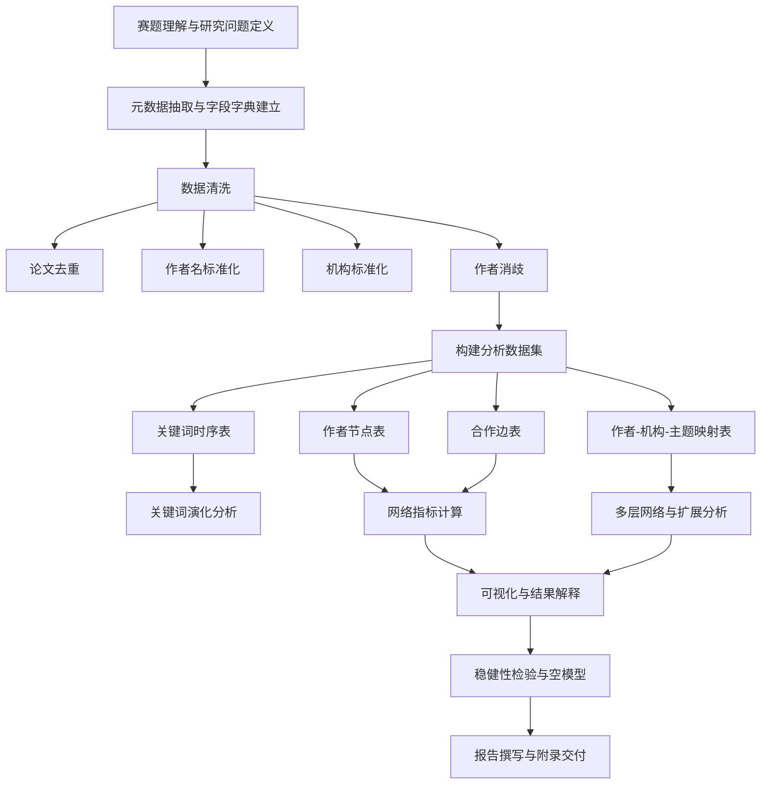
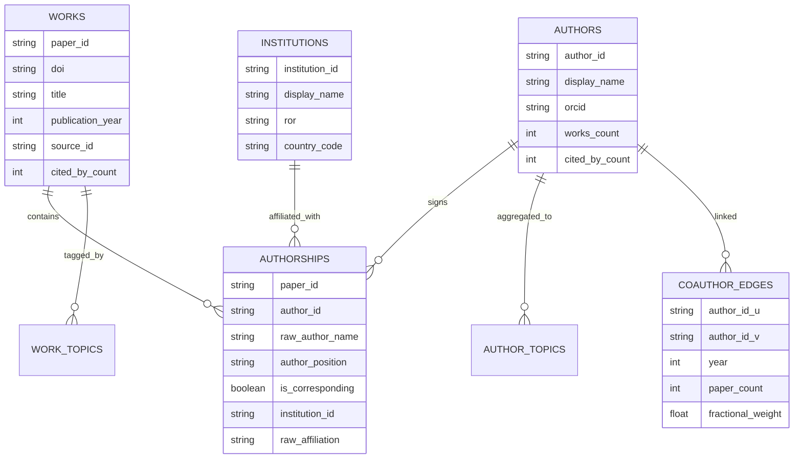
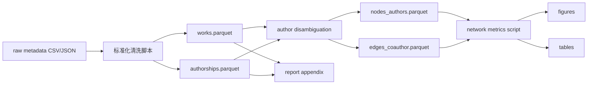

# 竞赛型数据报告与作者合作网络设计指南

## 执行摘要

从你上传的赛题与数据说明看，报告不应只停留在“关键词演化”和“作者合作网络”两个图上，而要形成一个**从数据来源、清洗、建模、解释、验证到复现交付的完整分析闭环**。赛题本身已经明确要求围绕近五年论文元数据展开分析，并把关键词演化、作者合作网络、文本挖掘、可视化与知识组织能力作为重点；评分也不仅看“做了什么”，还看方法是否严谨、结果是否可解释、表达是否完整。fileciteturn0file1 fileciteturn0file0

对“作者合作网络”，最关键的不是先画图，而是先定义**谁是作者节点、什么算合作边、边权怎么算、时间怎么切片、作者重名怎么消歧、缺失机构和 ORCID 怎么处理**。如果这些前置设计不清楚，后续的中心性、社群、桥梁作者、跨机构合作、主题迁移等结论都容易失真。OpenAlex 等主流开放学术知识图谱已经把 `author`、`author_position`、`is_corresponding`、`institutions`、`raw_author_name`、`raw_affiliation_strings`、`orcid` 等字段组织到了 work/authorship 结构中，并明确建议**先把名字解析到 author ID，再做后续分析**。citeturn30view0turn32view0turn32view1turn32view2turn33view3

在竞赛报告中，作者合作网络最有价值的输出通常不是“全网毛线球图”，而是三类更有判读力的结果：其一，**网络结构画像**，例如密度、平均度、巨型连通分量、核心层、社群数；其二，**关键角色画像**，例如高产枢纽、跨社群桥梁、跨机构中介、主题连接人；其三，**动态演化画像**，例如合作从分散走向聚合，或者从单中心走向多中心。相应地，图表也要从“漂亮”转向“可回答问题”。NetworkX、igraph、graph-tool、Gephi、Cytoscape、Plotly、D3、pyvis 都能覆盖不同规模和交互需求，但它们适用的数据量和工作流差异很大。citeturn44view0turn44view1turn44view2turn44view3turn45view0turn45view1turn28view0turn9view0turn27view0turn9view2turn25view0turn24view0turn25view3turn26view0turn26view4

下面这份报告给你的不是“概念梳理版答案”，而是一套能直接塞进竞赛文档的方法框架，包括：报告目录如何扩展、作者合作网络需要哪些数据字段、如何做清洗与消歧、网络如何定义与加权、指标如何计算与解释、图应该怎么选、怎么做稳健性与空模型验证、最后该交付哪些图表附录，以及可以直接改写的中文方法段落和图注模板。相关建议以你赛题的要求为导向，但方法本身也符合主流网络科学和文献计量学实践。fileciteturn0file1 fileciteturn0file0 citeturn34view0turn35academia2turn36academia1turn37academia1

## 赛题导向的数据报告框架

如果你只写“数据概况—关键词演化—合作网络—结论”，通常不够竞赛化。更稳妥的做法，是把报告写成**可审计的分析产品**。下面这个结构，既能覆盖赛题要求，也能把你的方法严谨度拉起来。赛题本身强调数据分析、文本挖掘、可视化展示与报告表达，因此报告章节最好对这些环节一一落位。fileciteturn0file1 fileciteturn0file0

### 推荐报告主结构

| 章节 | 你要回答的核心问题 | 建议输出 |
|---|---|---|
| 研究目标与任务理解 | 赛题到底要你解释什么现象 | 研究问题清单、分析范围、术语定义 |
| 数据来源与样本说明 | 数据从哪里来、覆盖哪些对象 | 数据表结构、时间范围、样本量、字段说明 |
| 数据预处理与质量控制 | 数据能不能直接用 | 去重、缺失、标准化、消歧、异常值处理 |
| 描述性统计 | 数据的基本面是什么 | 年度发文、作者数、机构数、期刊/会议分布 |
| 关键词与主题演化 | 研究热点如何变化 | 关键词频次趋势、突现词、主题迁移 |
| 作者合作网络分析 | 合作结构如何组织 | 网络定义、指标、社群、关键作者、动态切片 |
| 扩展分析 | 除了题面点名内容还能发现什么 | 机构合作、作者—主题二模网络、引用影响、跨域合作 |
| 结果解释与讨论 | 图上现象为什么重要 | 机制解释、领域背景、竞赛意义 |
| 稳健性与局限性 | 结果可靠吗 | 阈值敏感性、空模型比较、缺失偏差、方法边界 |
| 复现与附录 | 别人能否复现 | 代码框架、参数表、字段字典、图表附注 |

### 除了关键词演化和作者合作网络，还建议加入什么

除题面已经提到的内容外，最值得加入的四块是：

其一是**数据质量与方法假设**。这是很多竞赛报告最薄弱的一段，但恰恰最能体现专业度。你要明确写出：作者重名如何处理、机构字符串如何标准化、是否把超大团队论文纳入合作边、时间戳采用发表年还是在线年、作者顺序是否参与加权。ORCID 是高质量锚点，但覆盖并不完整；同时，近期评估研究显示，缺少 affiliation 的作者更容易出现消歧异常，而带 ORCID 的作者异常率更低，因此你的报告必须把“消歧不确定性”列为局限。citeturn32view0turn32view2turn15academia5turn35academia2

其二是**机构合作与多层网络**。赛题以论文元数据为基础，天然适合再往上做 “作者—机构—主题” 三层分析。OpenAlex 的 authorship 结构把作者与机构、国家、主题都连在 work 上，这使得你不必局限于单层作者网，可以进一步回答“哪些机构是跨社群桥梁”“哪个主题最容易吸引跨机构合作”“主题演化是否带动合作网络重组”等问题。citeturn29view0turn32view0turn32view1

其三是**影响力与合作结构的耦合**。如果你的数据有 `cited_by_count` 或类似引用字段，可以把“高被引论文的合作规模”“中心作者与引用表现的关联”“社群结构与影响力分布”写出来。OpenAlex API 明确支持 work 和 author 层面的 `cited_by_count`、`works_count`、`summary_stats.h_index` 等排序与统计字段。citeturn30view0turn31view0turn33view0turn33view1turn33view2

其四是**复现性与交付规范**。竞赛评委通常不会逐行跑你的代码，但会非常敏感于：字段命名是否清晰、流程是否可重现、图注是否自洽、附录是否能支撑结论。也就是说，优秀报告不只是“分析多”，而是“证据链完整”。这和正式研究写作很像。citeturn27view0turn34view2

### 适合放进报告首页的方法流程图



## 作者合作网络的数据设计与清洗

### 原始字段与派生字段应该怎么设计

作者合作网络至少要有三张核心表：**论文表 works、作者署名表 authorships、合作边表 edges**。如果你后面还要做机构合作和主题合作，再加两张映射表：**author_affiliation** 与 **author_topic**。OpenAlex 的 work/authorship 结构已经能提供非常多你需要的字段，包括作者 ID、ORCID、作者顺序、通讯作者标记、机构、国家、原始作者名和原始机构串。citeturn30view0turn32view0turn32view1turn32view2turn33view3

| 数据层 | 必需字段 | 强烈建议字段 | 用途 |
|---|---|---|---|
| 论文表 works | `paper_id`、`title`、`publication_year` | `doi`、`source_id`、`source_name`、`cited_by_count`、`topic_ids`、`keyword_ids` | 唯一标识论文、做时间切片、影响力分析 |
| 作者署名表 authorships | `paper_id`、`author_id`、`raw_author_name` | `orcid`、`author_position`、`is_corresponding`、`institution_ids`、`country_codes`、`raw_affiliation_strings` | 构造作者节点、边、顺序权重、消歧 |
| 作者表 authors | `author_id`、`display_name` | `orcid`、`works_count`、`cited_by_count`、`h_index` | 节点属性、作者画像 |
| 机构表 institutions | `institution_id`、`display_name` | `ror`、`country_code`、`type` | 机构分层分析、同质性分析 |
| 合作边表 edges | `author_id_u`、`author_id_v`、`paper_id`、`year` | `edge_weight_binary`、`edge_weight_count`、`edge_weight_fractional` | 网络构建与多权重对比 |
| 作者—主题映射 | `author_id`、`topic_id`、`paper_id` | `topic_score`、`year` | 主题—合作耦合、多层网络 |

如果原始数据源没有 ORCID 或机构 ID，你也可以先构建一个“比赛可用级”的字段体系：`canonical_author_name`、`author_name_key`、`canonical_affiliation`、`paper_dedup_key`。这些都属于**派生字段**，但对后续消歧非常关键。作者名键常见写法是：姓氏小写 + 名字首字母 + 去重音符号；机构键则是机构主名 + 国家代码。这个过程属于工程规范，不是学理定义，但竞赛中非常必要。citeturn35academia1turn36academia1turn36academia3

### 一个可直接落地的数据模型



### 清洗、去重与作者消歧的实际步骤

作者合作网络最怕两类错误：**同一人被拆成多个人**，以及**不同人被并成一个人**。因此清洗顺序应该固定，而不是“看到什么改什么”。

先做论文层去重。若有 DOI，优先按 DOI 去重；没有 DOI 时，再用 “标题标准化 + 年份 + 第一作者标准化名” 形成去重键。标题标准化包括去大小写、去标点、去 HTML、合并连续空格。这样可以最大限度减少同文多条记录导致的虚假合作边。OpenAlex 提供 work ID 和 DOI 作为外部标识入口，这类唯一标识应优先使用。citeturn30view0turn31view0

再做作者名标准化。把 `raw_author_name` 和 `display_name` 都保留下来，但新增 `canonical_author_name` 用于聚类比较。标准化步骤通常包括：统一大小写、去空格与标点变体、处理重音与转写、拆分姓与名、抽取首字母。注意，**标准化不是消歧**，标准化只是为消歧提供候选对。OpenAlex 的 authorship 中保留 `raw_author_name` 恰恰说明“原始署名形式”和“消歧后的 author entity”都值得留存。citeturn32view0turn32view3

然后做机构字符串标准化。能映射到机构 ID 或 ROR 的最好；映射不到时，至少建立 canonical affiliation。机构信息之所以重要，不只是为了画机构合作图，更因为它是作者消歧的重要特征。近期研究指出，没有 affiliation 信息的作者更容易出现职业路径异常，反映出消歧质量下降；相对地，带 ORCID 的作者异常更少。citeturn15academia5turn32view0turn32view2

最后是作者消歧。最稳的规则是：

首先，**有 author_id/ORCID 时，优先信任持久标识符**。OpenAlex 官方文档明确写出了“名字有歧义，ID 没有；先把名字解析为 ID，再过滤 works”。citeturn30view0

其次，**无 ORCID 时用多特征匹配**。主流作者消歧研究普遍使用合作者、机构、题名/关键词、期刊/会议、时间连续性等特征；不应只用姓名。比较研究显示，仅用姓名远不如结合多信息特征的无监督或半监督方法。citeturn35academia1turn36academia1turn36academia3

再次，**把消歧写成分层规则而不是黑箱模型**。竞赛里最推荐的不是深模型优先，而是“规则 + 相似度 + 人工抽查”的组合。例如：  
同姓同首字母进入候选块 → 比较机构相似度、合作者重叠、主题向量余弦、年份连续性 → 超过阈值则合并。基于 ORCID 链接的标注数据研究表明，ORCID 很适合做外部权威标签来源，至少可用于抽样验证你的消歧策略。citeturn35academia2turn35academia0

### 缺失值处理与必要假设

| 问题 | 处理建议 | 报告中必须说明的假设 |
|---|---|---|
| 缺 ORCID | 不删除作者，改用多特征消歧 | ORCID 仅作高置信锚点，不作唯一入口 |
| 缺机构 | 保留作者节点，但不参与机构同质性或跨机构统计 | 机构缺失可能低估跨机构合作强度 |
| 作者超过 100 人 | 单独标记“大团队论文”，做敏感性分析 | OpenAlex authorships 默认仅含前 100 位作者，可能低估超大团队边数 |
| 缺引用数 | 网络结构分析照做，影响力分析分层进行 | 结构指标与影响力指标样本基数不同 |
| 作者顺序跨学科含义不同 | 只把作者顺序作为可选权重，不直接解释贡献大小 | 作者顺序不等价于贡献强弱，且 CRediT 明确“不用于决定 authorship” |

这里尤其要注意两点。第一，OpenAlex 的 work `authorships` 在 API 中对作者数量有前 100 位限制，因此如果你的比赛数据来自类似开放源，超大团队论文可能需要单列处理。第二，CRediT 虽然提供了 14 类贡献角色，并支持多角色、多贡献者映射，但 NISO 明确指出它**不是**用来决定作者资格的，而是补充说明贡献结构；因此不能简单把“第一作者/通讯作者/最后作者”直接解释为“贡献最大/资源最多/领导者”，只能在报告中作为一种约定俗成但带学科差异的弱信号使用。citeturn32view1turn34view0turn34view1turn34view2

## 网络构建方案与指标体系

### 节点、边与权重怎么定义

作者合作网络最常见的定义是：**节点为作者，若两位作者共同署名同一篇论文，则在两节点之间连一条无向边**。这是文献计量和科学合作研究中的标准做法，因为共著关系本质上更接近对称关系。citeturn40search6turn37academia1

但竞赛中只做一种定义不够，你应该至少构造三种边权版本，并做对比：

| 版本 | 边定义 | 数学形式 | 适用场景 | 风险 |
|---|---|---|---|---|
| 二元边 | 共同署名即记 1 | \(w_{ij}=1\) | 看连通性、社区轮廓 | 忽略合作强弱 |
| 频次边 | 共著一次加 1 | \(w_{ij}=\sum_p \mathbf{1}_{ij\in p}\) | 看长期稳定合作 | 大团队论文会放大边数 |
| 分数边 | 一篇论文的合作贡献在作者对之间分摊 | \(w_{ij}=\sum_p \frac{1}{\binom{n_p}{2}}\) 或 \(\sum_p \frac{1}{n_p-1}\) | 抑制超大团队偏差 | 可解释性稍弱 |

实践建议是：**正文给出频次边结果，附录补充分数边稳健性分析**。如果你担心超大团队论文把网络“充胖”，就采用分数权重作为主分析，频次权重作为补充。因为一篇 2 人论文和一篇 80 人论文在“合作强关系”的意义上显然不该被等价看待。这个判断属于方法设计上的推论，但其合理性与配置模型/期望度模型等对边密度敏感的比较框架是一致的。citeturn42view1turn43view1

### 是否需要有向网络

常规合作网络建议以**无向图**为主，因为“共同署名”是对称事件。若你一定要做有向网络，只推荐两种场景：

一是把边方向定义为“第一作者/通讯作者 → 其他作者”或“资深作者 → 初级作者”的**角色流向网络**；二是把不同层的关系变成作者到机构、作者到主题的**二模或异构网络**。但这两种定义都需要在报告里明确说明：它们是方法上的建模近似，而不是合作关系的客观真相。因为作者顺序在不同学科中语义差异很大，而 CRediT 也明确区分“贡献角色”与“作者资格”。citeturn32view0turn33view3turn34view1turn34view2

### 时间切片与多层网络怎么做

你至少应准备三种时间组织方式：

其一，**年度快照**。每年一个合作网络，适合看作者数、边数、密度、最大连通分量、社群数的年度变化。  
其二，**滚动窗口**。如 2 年或 3 年滚动网络，适合减少单年波动。  
其三，**累积网络**。从起始年不断累积，适合展示合作版图扩张。  
时间网络研究的核心观点是：边何时出现、持续多久、是否重复出现，本身就是网络的一部分，不应只看静态拓扑。citeturn37academia1

如果你想把作者合作做得比别人更进一步，最值得加的是一个**多层网络**：

- 作者层：作者—作者共著  
- 机构层：机构—机构合作  
- 主题层：主题—主题共现  
- 跨层边：作者—机构、作者—主题、论文—主题

这样你可以回答：一个作者是“高连接”作者，还是“跨主题桥梁”作者，抑或“跨机构中介”作者。OpenAlex 本身就是一个异构图式数据集，这种多层建模在数据结构上是顺手的。citeturn29view0turn30view0

### 必算指标、公式与解释

下表是竞赛里最值得保留的一组指标。不是越多越好，而是要让每个指标都能回答一个清楚的问题。

| 指标 | 公式 | 它回答什么 | 解释要点 |
|---|---|---|---|
| 度 \(k_i\) | \(k_i=\sum_j a_{ij}\) | 该作者直接合作过多少人 | 最直观的合作广度 |
| 加权度 \(s_i\) | \(s_i=\sum_j w_{ij}\) | 合作强度总量多大 | 能区分“一次性广撒网”和“深度合作” |
| 归一化度中心性 | \(C_D(i)=\frac{k_i}{n-1}\) | 跨网络可比的连接广度 | simple graph 中最大为 1；NetworkX 用 \(n-1\) 归一化。citeturn44view0 |
| 中介中心性 | \(c_B(v)=\sum_{s,t}\frac{\sigma(s,t\mid v)}{\sigma(s,t)}\) | 该作者是否站在很多最短路径上 | 高值通常意味着桥梁或守门人。citeturn44view1 |
| 接近中心性 | \(C(u)=\frac{n-1}{\sum_v d(v,u)}\) | 到其他作者平均有多近 | 更适合连通图；多分量时要说明修正方式。citeturn44view2 |
| 特征向量中心性 | \(\lambda x_i=\sum_{j\to i}x_j\) | 是否连接到“重要的人” | 高值不只看朋友多，还看朋友强。citeturn44view3 |
| PageRank | \(PR(i)=\frac{1-\alpha}{N}+\alpha\sum_{j\in In(i)}\frac{PR(j)}{out(j)}\) | 在带方向/权重网络中的累计声望 | 更适合有向或转移意义明确的图；阻尼系数常取 0.85。citeturn45view0 |
| 聚类系数 | \(c_u=\frac{2T(u)}{deg(u)(deg(u)-1)}\) | 我的合作伙伴彼此是否也合作 | 高值表示“朋友圈闭合”。citeturn45view1 |
| k-core / core number | k-core 为“所有节点度至少为 \(k\) 的极大子图” | 谁位于网络核心层 | 比度更稳，适合识别核心圈。citeturn46view0 |
| 约束系数 constraint | \(c(v)=\sum_{w\in N(v)\setminus\{v\}}\ell(v,w)\) | 关系是否过度冗余 | 低 constraint 通常意味着更强桥接潜力。citeturn46view1 |
| 属性同质性 assortativity | \(r=\frac{\mathrm{tr}(M)-\|M\|^2}{1-\|M\|^2}\) | 同机构/同主题/同国家是否更爱合作 | 可检验“同类相吸”。citeturn46view2 |

### 社群检测应该怎么写

社群检测你至少保留两种算法，正文主报一种，附录给另一种对照。

| 算法 | 核心思想 | 适用建议 | 局限 |
|---|---|---|---|
| Louvain | 基于模块度优化的启发式方法 | 快，适合大多数竞赛网络；NetworkX 和 Gephi 都常用 | 受分辨率参数影响，随机性存在。citeturn45view2 |
| Infomap | 基于随机游走与信息压缩的 map equation | 对流动结构和层级结构常更敏感 | 结果更依赖流解释，和模块度社群不一定一致。citeturn38academia0turn38academia3 |

Louvain 在报告里推荐这样解释：它不是“找最密的小团体”，而是在不同尺度上寻找**使网络模块度提升的划分**。NetworkX 文档指出，Louvain 生成的是一个层级分区树，`resolution<1` 倾向更大社群，`resolution>1` 倾向更小社群；因此你应做 0.8、1.0、1.2 三组敏感性比较。citeturn45view2

### 适合做的时间指标

严格意义上的时间网络指标很多，但竞赛里最实用的是以下几类：

| 指标 | 定义建议 | 意义 |
|---|---|---|
| 节点持续率 | 某作者出现在多少个时间片中 | 区分长期活跃者与短期出现者 |
| 边稳定率 | 某合作边在多少个时间片重复出现 | 识别一次性合作与稳定合作 |
| 新增作者率 | 本期新出现作者占比 | 反映网络开放性 |
| 新增边率 | 本期新合作边占比 | 反映合作扩张速度 |
| 社群迁移率 | 作者在时间片间变更社群的比例 | 反映合作重组 |
| 核心保持率 | 上期核心作者本期仍在核心层的比例 | 反映网络核心稳定性 |

这些时间指标可以被视为基于快照网络的操作化定义，适合作为竞赛中的“动态网络”简化方案。严格的时间网络理论强调边的激活时序会改变传播与可达结构，因此在报告中建议明确说明：你采用的是**snapshot-based temporal approximation**。citeturn37academia1

## 可视化设计与工具选型

### 图不是越多越好，而是要和问题匹配

很多报告失败，不是因为指标算错，而是因为图表类型不对应研究问题。作者合作网络尤其如此：全网力导图最好只用一次，而且只用在“整体结构展示”；其他问题要换图。

| 图类型 | 最适合回答的问题 | 适用规模 | 优点 | 缺点 | 参数建议 |
|---|---|---:|---|---|---|
| 静态网络图 | 整体结构、核心社群 | 100–800 节点 | 直观 | 易毛线球化 | 过滤到主连通分量；节点大小映射 \(s_i\) 或 PageRank；颜色映射社群 |
| 力导布局图 | 社区分离、桥梁观察 | 100–1500 节点 | 结构感强 | 布局不稳定 | Gephi ForceAtlas2，开启 Prevent Overlap，适当提高 Scaling。citeturn27view0 |
| 圆形弦图 chord | 机构间/主题间流动 | 10–40 类别 | 比较类间联系很强 | 节点过多会难读 | 用聚合后的机构或主题；D3 chord 需要 \(n\times n\) 流矩阵。citeturn26view4 |
| 邻接矩阵 heatmap | 社群块结构是否清晰 | 200–3000 节点 | 不怕遮挡 | 对大众不够直观 | 按社群和核心数排序后再画 |
| Sankey | 作者→机构→主题流向 | 聚合层级数据 | 适合展示流转 | 不能看微观拓扑 | Plotly 可直接设置 `source/target/value`。citeturn24view0 |
| 时间线 / 折线图 | 作者数、边数、密度、核心率演化 | 任意 | 最稳、最清楚 | 不展示拓扑 | 必备，不可省 |
| 动态网络动画 | 合作演化过程 | 100–500 节点 | 观感强 | 容易炫技化 | 固定节点坐标或使用前一期布局作初值 |
| Ego 网络 | 单个关键作者的合作圈 | 1–3 跳邻域 | 非常适合讲故事 | 不能代表全网 | 报告中建议针对 3–5 位关键作者展示 |
| 社群流图 / alluvial | 社群随时间分裂合并 | 5–20 社群 | 适合动态社群 | 依赖前期社群对齐 | 适合附录强化动态分析 |
| 热力图 | 机构×主题、国家×年份 | 聚合二维表 | 对比性强 | 不看拓扑 | 适合辅助解释网络结论 |

### 视觉编码怎么定

最稳的一套编码是：

- **节点大小**：优先映射加权度或 PageRank。因为二者更符合“合作影响力”的直觉。citeturn45view0turn44view0  
- **节点颜色**：映射社群类别，而不是映射连续变量。连续变量更适合用大小或透明度。citeturn45view2  
- **边粗细**：映射合作频次或分数边权。  
- **边透明度**：降低到 0.1–0.4，避免边压过节点。  
- **标签**：只标注 Top-N 作者，N 通常不超过 15。Gephi 在 Preview 中可把标签大小绑定到节点大小。citeturn27view0

### 交互式图的建议

如果报告允许 HTML 附件，交互式网络非常加分，但请把交互用于**检索与解释**，不要只为炫技。

Plotly 官方文档演示了如何把 NetworkX 图转成交互式 Python 网络图；Plotly 也原生支持 Sankey，并支持 `hovertemplate`、`customdata`、节点位置自定义等，很适合比赛交付网页版附件。pyvis 则主打“用极少 Python 代码快速生成交互网络图”，节点 ID 与 label 设置非常直接。D3 更强，但更适合前端定制或高质量网页叙事。citeturn25view0turn24view0turn25view3turn26view0turn26view4

### 工具与库怎么选

| 工具 / 库 | 最适合的任务 | 优点 | 规模与限制 | 备注 |
|---|---|---|---|---|
| NetworkX | 原型开发、指标计算、教学友好 | API 最清晰，算法丰富 | 纯 Python；中大图性能弱，官方比较中远慢于 graph-tool/igraph，适合小中规模原型。citeturn44view0turn9view0 | 适合竞赛首版 |
| igraph / python-igraph | 正式批量计算、较大图 | C 核心，速度快，可与 Plotly/Matplotlib 结合 | 学习曲线略高 | 官方文档明确可做分析、可转多种格式。citeturn28view0 |
| graph-tool | 大图高性能分析 | C++/OpenMP，性能强 | 安装成本高，编译重 | 官方 benchmark 显示对大图算法明显快，但该基准较旧，只宜作方向性参考。citeturn9view0 |
| Gephi | 交互布局、出高质量静态图 | ForceAtlas2、外观调试、过滤方便 | 更偏 GUI，批处理弱 | Quickstart 已给出 CSV Source/Target 和 ForceAtlas2 工作流。citeturn27view0 |
| Cytoscape | 丰富表格属性、复杂样式、插件生态 | 节点/边属性与样式控制强 | 最初偏生物网络，但泛用 | 手册支持 GraphML、Excel、表列映射和自动布局。citeturn9view2 |
| Pajek | 经典大网络分析 | 适合某些文献计量传统流程 | 界面老，生态弱 | 在 bibliographic network 传统中常用于大网络与路径分析。citeturn22academia6turn22academia7 |
| Plotly | 交互式 Python 图表 | 网络图、Sankey、hover 很强 | 大型网络表现一般 | 最适合报告附件和网页交付。citeturn25view0turn24view0 |
| pyvis | 轻量交互网络 | 上手快、导出 HTML 方便 | 定制深度不及 D3 | 快速交付效果好。citeturn25view3 |
| D3 | 高自由度网页叙事可视化 | force/chord 等低层控制强 | 前端开发成本高 | 适合最终展示版，不适合临近截稿重构。citeturn26view0turn26view4 |

一个很实用的竞赛工作流是：  
**Python 清洗与计算 → Gephi 调布局导出静态主图 → Plotly/pyvis 导出交互附件**。  
这样你既有严谨计算，又有展示质量。citeturn27view0turn25view0turn25view3

## 复现、验证与最终交付

### 一个可复现的最小工作流



建议存储格式采用 **Parquet + CSV 双轨**：Parquet 用于计算，CSV 用于交付和人工检查。图文件则分为 PNG/SVG 与 HTML 两类，SVG 适合论文式排版，HTML 适合交互浏览。Gephi 也支持将项目和图导出为 `.gephi`、`.gexf`、`.graphml` 等格式，便于复现。citeturn27view0turn9view2

### Python 伪代码框架

```python
# 1) 读入并清洗
works = load_works()
auth = load_authorships()

works = dedup_works(works)
auth = normalize_author_names(auth)
auth = normalize_affiliations(auth)

# 2) 作者消歧
auth = resolve_ids_first(auth)      # 优先 author_id / ORCID
auth = cluster_unresolved_authors(auth,
                                  features=["coauthor", "affiliation", "title_topic", "venue", "year"])

# 3) 构边
edges = build_coauthor_edges(auth, weight_mode="fractional", time_key="publication_year")

# 4) 构图
G = build_graph(edges, nodes=make_author_nodes(auth, works))

# 5) 指标
metrics = compute_metrics(G, metrics=[
    "degree", "strength", "betweenness", "closeness",
    "eigenvector", "pagerank", "clustering", "core_number", "constraint"
])

# 6) 社群与时间切片
communities = run_louvain(G, resolution=1.0)
snapshots = build_snapshots(edges, mode="yearly")

# 7) 图和表
export_tables(metrics, communities)
draw_static_graph(G, metrics, communities)
draw_sankey(author_institution_topic_data)
draw_timelines(snapshot_stats)
```

### R 伪代码框架

```r
library(data.table)
library(igraph)

works <- fread("works.csv")
auth  <- fread("authorships.csv")

# 清洗
works <- dedup_works(works)
auth  <- normalize_names(auth)
auth  <- normalize_aff(auth)

# 构边
edges <- build_edges(auth, weight_mode = "fractional")

# 建图
g <- graph_from_data_frame(edges, directed = FALSE)

# 指标
V(g)$degree <- degree(g)
V(g)$strength <- strength(g, weights = E(g)$weight)
V(g)$btw <- betweenness(g, weights = 1 / E(g)$weight)
V(g)$eig <- eigen_centrality(g, weights = E(g)$weight)$vector
V(g)$core <- coreness(g)
clu <- cluster_louvain(g, weights = E(g)$weight)
```

### 验证、空模型与稳健性怎么做

这一部分会显著提高你的报告说服力。推荐至少做三层验证。

第一层是**参数敏感性**。比较二元边、频次边、分数边；比较年度、2 年滚动、3 年滚动；比较 Louvain 的不同 `resolution`；比较是否纳入超大团队论文。只要关键结论在这些设置下方向一致，你的结论就更稳。Louvain 的分辨率参数确实会改变社群粒度，NetworkX 文档对此说得很明确。citeturn45view2

第二层是**空模型比较**。至少做两种：

- **度保持随机化**：对原图做 `double_edge_swap`，保持节点度不变，检查原图的聚类、模块度、中介集中度是否显著高于随机网络。citeturn41view0  
- **配置模型 / 期望度模型**：用 configuration model 或 expected-degree graph 建立基线，对比原图结构并说明“这不是偶然由度分布带来的”。configuration model 保持给定度序列但允许自环和重边；expected-degree graph 则按 \(p_{uv}=w_u w_v/\sum_k w_k\) 生成给定期望度的随机图。citeturn42view1turn43view1

第三层是**消歧质量抽样验证**。抽取高频中文名、常见英文名、无机构信息作者三组样本，人工核对或借助 ORCID/高置信 author ID 进行检验。ORCID 关联数据已被用于大规模作者消歧评估，适合作为外部权威标签来源。citeturn35academia2turn35academia0

如果你还想再进一层，可以在附录中做**显著性变化判断**。Rosvall 与 Bergstrom 在动态网络研究中强调，研究网络变化时必须区分“真实结构变化”和“随机波动”，这也是为什么 alluvial diagram 和 bootstrap significance 在长期网络比较中很常见。citeturn38academia2

### 最终交付建议清单

正文建议至少包含以下图表：

| 类型 | 建议条目 |
|---|---|
| 主图 | 作者合作网络主图 1 张；核心子网图 1 张；机构合作图 1 张 |
| 时间图 | 年度发文量、作者数、边数、密度、最大连通分量、核心保持率各 1 张 |
| 对比图 | 指标 Top20 作者条形图；社群规模分布图；机构/主题热力图 |
| 流向图 | 作者—机构—主题 Sankey 或机构间弦图 |
| 表格 | 字段字典表、清洗规则表、指标解释表、关键作者画像表、社群画像表 |
| 附录 | 参数表、阈值敏感性结果、空模型对照、消歧抽样核验说明、代码目录树 |

### 可直接放进报告的中文方法段落模板

**方法段落模板**

> 本文以论文元数据中的作者署名关系为基础构建作者合作网络。将作者视为节点，若两位作者共同署名同一篇论文，则在两节点之间建立一条无向边。为减弱超大团队论文对网络结构的放大效应，本文同时构建了二元边、频次边和分数边三种权重体系，并以分数边网络作为主分析对象。作者身份优先采用外部持久标识符进行归并；对于缺乏稳定标识符的作者记录，则结合作者名标准化结果、机构信息、合作者集合、题名主题相似性以及时间连续性进行分层消歧。随后计算度、加权度、中介中心性、接近中心性、特征向量中心性、PageRank、聚类系数、k-core 与约束系数等指标，并采用 Louvain 算法识别社区结构。为检验结果稳健性，进一步比较不同边权定义、时间切片方式与社区分辨率参数下的结果一致性，并通过度保持随机化网络进行空模型对照。citeturn44view0turn44view1turn44view2turn44view3turn45view0turn45view1turn46view0turn46view1turn45view2turn41view0turn42view1

**图注模板**

> 图 X 展示了样本期内作者合作网络的核心结构。节点大小表示作者加权度，颜色表示 Louvain 社区类别，边宽表示作者间累计合作强度。为提升可读性，仅保留最大连通分量及边权高于阈值的合作关系。可以观察到，网络已形成若干相对清晰的合作团簇，其中位于团簇交界处的高介数作者在跨社区联系中发挥桥梁作用。citeturn45view2turn44view1turn44view0

> 图 Y 展示了作者合作网络在不同年份快照下的核心指标变化。结果表明，网络规模随时间持续扩张，但密度并未同步上升，说明新增合作更多表现为网络外延扩展而非全面加密；与此同时，核心层作者比例保持相对稳定，表明合作网络存在持续的结构中心。该结论后续结合空模型与参数敏感性分析进行稳健性验证。citeturn37academia1turn46view0turn41view0

### 开放问题与局限

这套方案已经足够支持一份高质量竞赛报告，但仍有几个边界需要在文末主动说明。第一，如果比赛数据本身已做过作者聚合，你能做的是“审慎继承并验证”，而不是重新构建完整学术身份系统。第二，作者顺序和通讯作者语义具有学科差异，不宜直接解释为贡献大小。第三，若原始数据来自开放知识图谱，字段覆盖和更新机制会影响机构、语言、引用等元数据质量；OpenAlex 本身也在持续迭代中，因此应把数据版本和抓取时间写入附录。第四，若存在超大团队论文，合作图可能被巨型团块主导，必须通过分数加权与敏感性分析控制。citeturn34view1turn29view0turn15academia4turn15academia7turn32view1

如果你要把这份指南转成真正的赛题报告，我最推荐的写法是：**正文只保留一条最清晰的主线，附录放稳健性、字段字典、消歧规则、参数表和补充图**。这样既能让评委快速读懂结论，也能让方法部分经得起追问。fileciteturn0file1 fileciteturn0file0