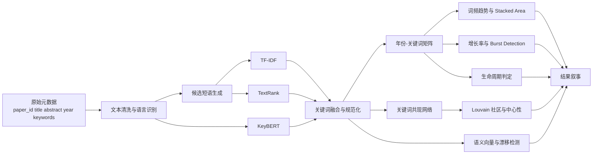

# 竞赛论文方法章节写法与实现方案

本章面向“面向科技文献智能分析的科研智能体构建”赛题中的“关键词演化”模块，给出一套可直接复制进报告的方法章节模板。赛题数据明确包含标题、摘要、作者、发表年份、关键词等元数据，规模约五万篇、时间跨度五年，且官方期望成果明确要求提交“数据分析报告”，其中点名包含“关键词演化”。fileciteturn0file0 fileciteturn0file1

方法设计上，建议把“关键词演化”从简单词频统计提升为六层分析：关键词提取、年份—关键词矩阵、趋势分析、突变检测、共现网络、语义漂移，再补上一套生命周期规则，把“热点出现—扩散—成熟—衰退”的叙事闭环做完整。这样既回应赛题要求，也符合评分标准中对“技术创新”“图表展示形式多样”和“结果可复现”的强调。fileciteturn0file1

在实现层面，推荐采用 Python 技术栈：`pandas` 负责清洗与整形，`scikit-learn` 实现 TF-IDF，`KeyBERT` 与 `sentence-transformers` 负责语义级关键词和漂移分析，`networkx` 与 `python-louvain` 完成共现网络和社区发现，`gensim` 作为可选的词向量基线，`burst_detection` 用于 Kleinberg 突变检测。相关库的官方文档或 PyPI 页面均提供了安装、参数和 API 说明。citeturn13view0turn14view1turn11view0turn12view3turn12view2turn12view4turn15view0turn7view0

## 数据

赛题官方说明给出的可用字段包括论文 ID、标题、摘要、作者列表、发表年份，以及部分样本中的关键词与全文；考虑到赛题样本时间跨度为五年，最稳妥的时间切片单位是“年”。若原始数据只有 `year` 而无更细粒度日期，则本章所有演化分析均以年度为最小时间片。fileciteturn0file0 fileciteturn0file1

建议在方法章节中先明确“原始字段”和“派生字段”，避免评委误以为“关键词”完全来自原始数据。关键词演化任务的最小可用输入其实是：`paper_id + year + title + abstract`；作者提供的 `keywords` 若存在，应优先作为校验集或融合源使用，而不是直接把问题简化为对原始关键词做统计。这样写更严谨，也更符合科研型报告的规范。fileciteturn0file0

下表给出建议的数据字段设计。表中“用途”列可直接复制到方法章节。

| 字段类别 | 字段名 | 数据类型 | 是否必需 | 用途 |
|---|---|---:|---|---|
| 原始字段 | `paper_id` | str/int | 必需 | 主键，连接所有中间表 |
| 原始字段 | `title` | str | 必需 | 与摘要拼接形成短文档文本 |
| 原始字段 | `abstract` | str | 必需 | 关键词提取、语义漂移的主要语料 |
| 原始字段 | `year` | int | 必需 | 时间切片、趋势与突变检测 |
| 原始字段 | `authors` | list[str] / str | 可选 | 非本章核心，但可与作者网络模块联动 |
| 原始字段 | `keywords_raw` | list[str] / str | 可选 | 用于评估或融合人工关键词 |
| 原始字段 | `full_text` | str | 可选 | 若可用，可提升关键词提取质量 |
| 派生字段 | `text` | str | 必需 | `title + abstract` 拼接后的分析文本 |
| 派生字段 | `lang` | str | 建议 | 中英混合语料时的语言分流 |
| 派生字段 | `tokens` | list[str] | 必需 | 清洗、词形归一、停用词过滤后的词序列 |
| 派生字段 | `candidates` | list[str] | 必需 | 候选关键词/短语集合 |
| 派生字段 | `keywords_tfidf` | list[(kw,score)] | 建议 | TF-IDF 提取结果 |
| 派生字段 | `keywords_textrank` | list[(kw,score)] | 建议 | TextRank 提取结果 |
| 派生字段 | `keywords_keybert` | list[(kw,score)] | 建议 | KeyBERT 提取结果 |
| 派生字段 | `keywords_final` | list[(kw,score)] | 必需 | 融合后的最终关键词 |
| 派生字段 | `keyword_norm` | str | 必需 | 统一词形后的标准关键词 |
| 派生字段 | `year_keyword_score` | long table | 必需 | 构建年份—关键词矩阵 |
| 派生字段 | `cooc_edges` | edge list | 建议 | 关键词共现网络边表 |
| 派生字段 | `community_id` | int | 建议 | Louvain 社区标签 |
| 派生字段 | `centrality_*` | float | 建议 | 度中心性、介数中心性、PageRank |
| 派生字段 | `embedding` | vector | 建议 | 关键词语义向量 |
| 派生字段 | `drift_score` | float | 建议 | 漂移程度 |
| 派生字段 | `burst_state` | int/bool | 建议 | 突变状态或突变段 |
| 派生字段 | `lifecycle_stage` | str | 建议 | 生命周期阶段标签 |

为满足“每步所需数据格式与最小样本量”的报告要求，建议再给出一张“流程—输入格式—样本需求”表。需要说明的是，大多数经典论文和官方文档并未给出硬性的“最小样本量”阈值；因此，下表把“文献/官方下限”和“逻辑下限”分开写，未明确规定的统一标注为“未指定”。citeturn18view0turn19view0turn8view0turn2view1

| 环节 | 输入格式 | 必需列/结构 | 文献或官方最小样本量 | 逻辑下限 | 竞赛实施建议 |
|---|---|---|---|---|---|
| 文本清洗 | DataFrame | `paper_id,text,year` | 未指定 | 至少 1 篇 | 建议全部样本参与 |
| TF-IDF 提取 | 文档列表 / 稀疏矩阵 | `text` | 未指定 | 至少 2 篇文档 | 至少每年几十篇更稳定 |
| TextRank 提取 | 单篇词图 | `tokens/candidates` | 未指定 | 单篇可运行 | 文本过短时退回 TF-IDF |
| KeyBERT 提取 | 文档列表 | `text` | 未指定 | 单篇可运行 | 批量推理更高效 |
| 年份—关键词矩阵 | long / wide table | `year,keyword,score` | 未指定 | 至少 2 个时间片 | 五年赛题适合按年建模 |
| 增长率分析 | 时间序列 | `freq_y` | 未指定 | 至少 2 年 | 可加 3 年滑动平均 |
| Kleinberg burst | 序列 `r,d,n` | 每年目标词频与总文档数 | 未指定 | 至少 3 个时间点 | 五年可用，但需谨慎解释 |
| 共现网络 | edge list | `source,target,weight` | 未指定 | 至少 2 个关键词共现 | 建议边权阈值去噪 |
| Louvain 社区发现 | 加权无向图 | `weight` | 未指定 | 至少 1 个连通子图 | 只画最大连通分量 |
| 语义漂移 | 向量序列 | `keyword,year,embedding` | 未指定 | 至少 2 个时间片 | 每词每年至少若干上下文更稳 |
| 生命周期模型 | 时间序列 | `year,freq,growth,burst` | 未指定 | 至少 3 个时间点 | 五年数据可定义四阶段 |

建议在章节中附上一张流程图，让评委一眼看出你的实现链条：



## 预处理

预处理的目标不是“把文本洗干净”这么简单，而是构造一套适合后续三个关键词提取器共用的统一输入。赛题数据以标题与摘要为主，因此推荐把 `title` 与 `abstract` 拼接为 `text`，分隔符统一使用句号或空格；若原始 `keywords_raw` 存在，则保留为独立列，仅用于后续评估与规则合并。fileciteturn0file0

建议采用如下预处理顺序：去重、缺失处理、大小写归一、特殊字符清理、语言识别、分词/词元化、词形还原、停用词过滤、短语候选生成、术语规范化。英文语料可直接走词形还原与 n-gram；若混有中文，可在语言识别后走分语言管线。由于赛题数据来源包含 arXiv 与 PubMed，英文内容通常占主体；而 KeyBERT 官方示例明确建议英文可用 `all-MiniLM-L6-v2`，多语言文本可用 `paraphrase-multilingual-MiniLM-L12-v2`。fileciteturn0file0 citeturn11view0

在竞赛报告里，最好把“术语规范化”单独写出来，因为评委非常容易质疑“同义词重复计数”。建议按以下规则统一关键词：复数还原为单数，大小写归一，连字符与空格常态化，常见缩写映射到主形式，例如 `GNN ↔ graph neural network`、`LLM ↔ large language model`。若有领域词表，可建立一张 `keyword_alias` 映射表；没有词表时，也应至少做字符串级规范化和人工抽查。这样做能直接提高后续年份矩阵、共现网络和生命周期模型的稳定性。

可直接写入报告的预处理伪代码如下：

```python
# 输入: papers[paper_id, title, abstract, year, keywords_raw]
# 输出: papers_clean[paper_id, year, text, tokens, candidates]

for paper in papers:
    text = concat(paper.title, paper.abstract)
    text = clean_unicode(text)
    text = normalize_case(text)
    text = remove_urls_emails_formula_noise(text)
    lang = detect_language(text)

    if lang == "en":
        tokens = tokenize_en(text)
        tokens = lemmatize(tokens)
    elif lang == "zh":
        tokens = tokenize_zh(text)
    else:
        tokens = generic_tokenize(text)

    tokens = remove_stopwords(tokens)
    tokens = remove_short_tokens(tokens, min_len=2)
    candidates = generate_ngrams(tokens, ngram_range=(1, 2))
    candidates = normalize_terms(candidates, alias_dict)

    save(paper_id, year, text, tokens, candidates)
```

本文建议的默认预处理参数可写成一段规范化说明：英文文本全部转小写；保留名词、形容词及领域短语优先；n-gram 优先取 `1–2`，当摘要较长且领域短语明显时可扩展到 `1–3`；去掉停用词、纯数字、过短词和明显的版式噪声。这里要强调：停用词表应区分“通用停用词”和“学术高频弱信息词”，后者如 `study`、`result`、`method`、`analysis` 是否保留，需要结合领域判断。

## 方法实现

这一节是整章的核心，建议按“关键词提取 → 年份矩阵 → 趋势与突变 → 共现网络 → 语义漂移 → 生命周期”连续展开。这样既符合论文逻辑，也便于评委顺着实现链条阅读。

**关键词提取方法设计。** 本文采用三种互补方法提取关键词，并对其结果进行融合：TF-IDF 负责高效提取高区分度词，TextRank 负责利用文内图结构抽取无监督关键词，KeyBERT 负责基于 Transformer 语义相似度生成更具语义完整性的短语。`TfidfVectorizer` 在 `scikit-learn` 中被定义为“将原始文档集合转换为 TF-IDF 特征矩阵”，其本质相当于 `CountVectorizer` 后接 `TfidfTransformer`；官方文档同时给出了 `ngram_range`、`max_df`、`min_df`、`sublinear_tf` 等核心参数。citeturn3view0turn3view1turn3view2turn3view3

TF-IDF 的实现建议写成如下定义。对文档 \(d\) 中术语 \(t\)：

\[
\mathrm{tfidf}(t,d)=\mathrm{tf}(t,d)\cdot \mathrm{idf}(t)
\]

在工程实现上，推荐参数为：`ngram_range=(1,2)`，`min_df=5`，`max_df=0.8`，`sublinear_tf=True`，`smooth_idf=True`，`norm='l2'`。其中 `min_df` 与 `max_df` 分别用于去除过稀和过泛的词；官方文档明确说明二者既可以是整数计数，也可以是文档占比。citeturn3view1turn3view2

TextRank 由 Mihalcea 与 Tarau 在 EMNLP 2004 提出，是一种面向文本图的排序方法，原文直接把它用于无监督关键词抽取，并指出在关键词任务中使用词共现关系建图。原论文给出的实现信息很适合直接写进方法章节：候选词在一个最大窗口内共现时连边，窗口可设为 2 到 10；关键词图可以设为无向无权图；节点初始分数设为 1，通常经过 20–30 次迭代，在阈值 0.0001 左右收敛；原文实验还显示，较大的共现窗口并没有带来更好的精度，而无向图优于有向图。citeturn18view0turn21view2turn21view3turn21view4

因此，竞赛实现里建议把 TextRank 的默认参数写成：候选词限定为名词、形容词及其短语；共现窗口 `window_size=2` 或 `3`；图类型为无向图；阻尼系数 `d=0.85`；最大迭代 `max_iter=30`；收敛阈值 `tol=1e-4`。其中阻尼因子在 TextRank 论文中被写为介于 0 与 1 之间，PageRank 在 NetworkX 中的默认阻尼参数 `alpha` 为 0.85，因而取 0.85 是合理且易于复现的工程设定。citeturn21view0turn9view3

KeyBERT 的官方说明明确指出，它通过 BERT 类嵌入提取与文档最相似的关键词和关键短语：先得到文档嵌入，再得到候选词/短语嵌入，最后用余弦相似度排序。官方示例同时提供了 `keyphrase_ngram_range`、`use_maxsum`、`use_mmr`、`diversity` 等关键参数，并建议英文用 `all-MiniLM-L6-v2`，多语言用 `paraphrase-multilingual-MiniLM-L12-v2`。citeturn11view0turn3view6turn3view7

因此，报告中可直接写明：KeyBERT 的默认参数设为 `keyphrase_ngram_range=(1,2)`，`top_n=10`，`use_mmr=True`，`diversity=0.5`；英文语料使用 `all-MiniLM-L6-v2`，中英混合或多语语料使用 `paraphrase-multilingual-MiniLM-L12-v2`。若担心重复短语过多，优先开启 MMR；如果更关注候选之间的整体差异，可以使用 Max Sum，但官方文档也提示其组合搜索复杂度更高。citeturn11view0turn3view6turn3view7

三种方法的比较建议写成表述性段落而不是“哪个好”的结论。可写为：TF-IDF 速度最快、最适合全量跑通与时间切片统计，但不建模语义；TextRank 不依赖语料库级统计，适合单篇文档结构化抽词，但对候选词质量和分词敏感；KeyBERT 能得到更自然的短语和更强的语义一致性，但计算成本最高。实际竞赛中，建议使用“TF-IDF/ TextRank 召回 + KeyBERT 重排”或“三路结果取并集后再做规范化”的融合策略，以兼顾覆盖率、可解释性和语义质量。TF-IDF 的经典权重思想在信息检索中长期沿用，而 TextRank、KeyBERT 分别代表图排序和语义嵌入两条范式。citeturn3view0turn18view1turn11view0

关键词提取的关键伪代码如下：

```python
# 输入: papers_clean[paper_id, year, text, tokens, candidates]
# 输出: keywords_final[paper_id, keyword, score, method]

# TF-IDF
tfidf = TfidfVectorizer(
    ngram_range=(1, 2),
    min_df=5,
    max_df=0.8,
    sublinear_tf=True,
    smooth_idf=True
)
X = tfidf.fit_transform(papers_clean["text"])
kw_tfidf = top_terms_per_doc(X, tfidf.vocabulary_, top_n=10)

# TextRank
for paper in papers_clean:
    G = build_cooccurrence_graph(
        tokens=filter_pos(paper.tokens),
        window_size=2,
        weighted=False,
        directed=False
    )
    scores = pagerank(G, alpha=0.85, max_iter=30, tol=1e-4)
    kw_textrank[paper.id] = top_n(scores, 10)

# KeyBERT
kw_model = KeyBERT(model="paraphrase-multilingual-MiniLM-L12-v2")
for paper in papers_clean:
    kw_keybert[paper.id] = kw_model.extract_keywords(
        paper.text,
        keyphrase_ngram_range=(1, 2),
        top_n=10,
        use_mmr=True,
        diversity=0.5
    )

# 融合
for paper_id in all_papers:
    merged = union_and_normalize(
        kw_tfidf[paper_id],
        kw_textrank[paper_id],
        kw_keybert[paper_id]
    )
    keywords_final[paper_id] = rerank(merged)
```

**年份—关键词矩阵构建。** 这是后续一切演化分析的统一底座。定义年度集合 \(Y\)，关键词集合 \(K\)，则构造矩阵 \(M \in \mathbb{R}^{|Y|\times |K|}\)。建议同时保留两种版本：绝对频次矩阵与归一化权重矩阵。绝对版本定义为：

\[
M_{y,k}^{(\text{freq})}=\sum_{d\in D_y}\mathbf{1}(k\in K_d)
\]

加权版本定义为：

\[
M_{y,k}^{(\text{score})}=\sum_{d\in D_y}\mathrm{score}(k,d)
\]

其中 `score(k,d)` 可取 TF-IDF 分数、TextRank 分数、KeyBERT 相似度分数，或三者归一后加权平均。报告中建议声明：趋势分析优先使用频次矩阵，主题份额与 stacked area 优先使用归一化矩阵，网络与语义漂移则回到论文级关键词实例。这样变量分工清晰，不容易混淆。

**词频趋势与 stacked area。** 对每个关键词 \(k\)，形成年度序列 \(\{M_{y,k}\}\)。建议同时计算绝对频次与年度份额：

\[
\mathrm{share}_{y,k}=\frac{M_{y,k}}{\sum_{k'}M_{y,k'}}
\]

趋势图层面，折线图适合展示 Top-10 或 Top-15 关键词的绝对增长；stacked area 更适合展示“不同主题在总研究中的占比变化”。在图注中应明确：若是 absolute trend，则 y 轴为论文数或关键词频次；若是 share trend，则 y 轴为年内占比。这样能避免不同年份论文总量变化造成的误读。

**突变检测。** 突变分析建议做两层。第一层是简单增长率，定义为：

\[
g_{y,k}=\frac{M_{y,k}-M_{y-1,k}}{\max(M_{y-1,k}, \varepsilon)}
\]

其中 \(\varepsilon\) 可取 1，防止分母为 0。这个指标容易解释，适合比赛汇报。第二层是 Kleinberg burst。Kleinberg 在 KDD 2002 中把“文档流中某主题的突然活跃”形式化为状态转移问题，并指出研究论文流也具有类似的 burst 现象；`burst_detection` 的 README 直接给出了 batched data 场景下的输入输出：每个时间片目标事件数 `r`、总事件数 `d`、时间点数 `n`，以及核心参数 `s`、`gamma`、`smooth_win`。其中 `s` 表示状态间倍增距离，`gamma` 表示上升到高状态的难度，`smooth_win` 为平滑窗口。citeturn19view0turn7view0

在五年期赛题数据上，建议的 burst 参数策略是：`s=2`，`gamma=1` 作为基线；若结果过于敏感、产生大量短 burst，则增大 `gamma` 到 `1.5–2.0`，或启用 `smooth_win=3`。需要在论文里明确写一句：Kleinberg 参数不存在通用最优值，本文通过少量代表性关键词进行人工校准，选择同时能识别已知热点与抑制噪声波动的参数组。这样既严谨，也符合实际。`burst_detection` 的示例调用恰好也是 `s=2, gamma=1`。citeturn7view0

突变检测的伪代码可以写成：

```python
# 输入: year_keyword_freq[year, keyword, freq], docs_per_year[year, total_docs]
# 输出: keyword_bursts[keyword, begin, end, weight]

for keyword in selected_keywords:
    r = np.array(freq_of_keyword_over_years(keyword), dtype=float)
    d = np.array(total_docs_over_years(), dtype=float)
    n = len(r)

    growth = (r[1:] - r[:-1]) / np.maximum(r[:-1], 1)

    q, d_out, r_out, p = bd.burst_detection(
        r, d, n, s=2, gamma=1, smooth_win=3
    )
    bursts = bd.enumerate_bursts(q, keyword)
    weighted_bursts = bd.burst_weights(bursts, r_out, d_out, p)

    save(keyword, growth, weighted_bursts)
```

**关键词共现网络。** 关键词共现网络反映的是“主题结构如何变化”，而不仅是“哪些词变多了”。构图规则建议写得非常明确：若两个关键词在同一篇论文的 `keywords_final` 中共同出现，则在它们之间连一条无向边。边权可以有三种常用写法。第一，简单计数权重：同现一次加 1。第二，分数权重：加上两关键词在文档中的平均得分。第三，分数归一或分数分摊权重：若一篇论文有 \(m\) 个关键词，则每条边增加 \(2/[m(m-1)]\)，用来削弱长关键词列表对网络密度的放大效应。报告里建议优先采用第三种，原因是它最适合比赛数据这类跨领域、关键词数量不均衡的场景。

网络建好后，使用 Louvain 做社区发现。Blondel 等人在 2008 年提出的 Louvain 方法是一种基于模块度优化的快速社区发现算法，适用于大规模网络；`python-louvain` 的 `best_partition` 接口提供了 `weight`、`resolution` 和 `random_state` 等参数，并指出其目标是获得模块度尽可能高的划分。citeturn17academia0turn8view0

因此，竞赛中建议使用：

```python
partition = community_louvain.best_partition(
    G,
    weight="weight",
    resolution=1.0,
    random_state=42
)
```

如果社区过粗，可将 `resolution` 提到 `1.2–1.5`；如果社区碎片过多，可调低到 `0.8` 左右。`python-louvain` 文档明确说明 `resolution` 会影响社区大小，而 `random_state` 决定随机性与可复现性。citeturn8view0

社区之外，节点层面建议至少计算三种中心性。NetworkX 文档将度中心性定义为“节点连接到其他节点比例”；介数中心性是“所有节点对最短路径中经过该节点的比例之和”；PageRank 则基于图中相互推荐关系计算重要性，默认阻尼参数为 0.85。citeturn9view2turn9view0turn9view3

这里有一个很容易被忽略、但非常适合写进报告体现专业度的实现细节：NetworkX 的加权介数中心性把 `weight` 解释为距离，而不是相似度或强度。因此，如果你的边权是“共现强度”，计算介数中心性时不要直接传原始权重，而应该先构造 `distance = 1/(weight + eps)`。这是官方文档明确说明的。citeturn9view1

关键词共现网络的核心伪代码如下：

```python
# 输入: keywords_final[paper_id, keyword, score]
# 输出: G(keyword graph), partition, centralities

G = nx.Graph()

for paper_id, group in groupby_paper(keywords_final):
    kws = group["keyword"].tolist()
    m = len(kws)
    if m < 2:
        continue
    for i, j in combinations(kws, 2):
        delta = 2 / (m * (m - 1))   # 分摊权重，抑制长列表偏置
        G[i][j]["weight"] = G[i][j].get("weight", 0) + delta

# 去噪
G = threshold_edges(G, min_weight=0.02)

# 社区发现
partition = community_louvain.best_partition(
    G, weight="weight", resolution=1.0, random_state=42
)

# 中心性
deg = nx.degree_centrality(G)
pr = nx.pagerank(G, alpha=0.85, weight="weight")

# 注意：介数中心性中的 weight 解释为距离
for u, v, data in G.edges(data=True):
    data["distance"] = 1.0 / (data["weight"] + 1e-9)
btw = nx.betweenness_centrality(G, weight="distance")
```

**语义漂移。** 词频增长只能说明“热了没热”，不能说明“意思变了没变”。语义漂移建议采用两种实现路线。第一条是“共享嵌入空间”路线：用同一个 `SentenceTransformer` 对各年关键词的上下文做编码，由于编码器固定，所以不同年份天然在同一向量空间里，避免了对齐问题。Sentence-BERT 论文与 `sentence-transformers` 官方文档都明确支持用余弦相似度比较句向量，文档还指出 `SimilarityFunction.COSINE` 是默认相似度。citeturn16academia1turn3view4turn12view0

第二条是“逐年词向量”路线：每年单独训练 `gensim` Word2Vec。Gensim 文档说明其实现了 skip-gram 与 CBOW，并暴露了 `min_count`、`workers`、`sg` 等参数；Mikolov 在 2013 年论文中则给出了 Word2Vec 的经典背景。citeturn3view8turn16academia0turn16academia2

对竞赛报告而言，我更推荐第一条路线，因为它更稳定、更容易复现。定义关键词 \(k\) 在年份 \(y\) 的上下文向量为当年所有包含 \(k\) 的论文上下文嵌入平均值：

\[
E_{y,k}=\frac{1}{|C_{y,k}|}\sum_{c\in C_{y,k}}\mathrm{Encoder}(c)
\]

相邻年份的漂移定义为：

\[
\mathrm{drift}_{y\rightarrow y+1}(k)=1-\cos(E_{y,k},E_{y+1,k})
\]

由于“漂移阈值”没有统一标准，本文建议采用分位数阈值而不是固定值：将所有关键词的年度漂移分数取全局 90% 或 95% 分位，超过阈值者定义为“显著漂移”；若更希望可解释，也可以采用 `均值 + 1 标准差`。这里要在文中明确写成“本文操作性定义”，而不要写成“公认阈值”。

语义漂移的伪代码建议写成：

```python
# 输入: papers_clean[text, year], keywords_final[paper_id, keyword]
# 输出: drift[keyword, year_from, year_to, drift_score]

model = SentenceTransformer("sentence-transformers/paraphrase-multilingual-MiniLM-L12-v2")

for keyword in vocabulary:
    for year in years:
        contexts = collect_contexts(keyword, year, papers_clean, window="sentence_or_abstract")
        if len(contexts) == 0:
            continue
        embs = model.encode(contexts, normalize_embeddings=True)
        E[year, keyword] = embs.mean(axis=0)

for keyword in vocabulary:
    for y1, y2 in adjacent_year_pairs(years):
        if (y1, keyword) in E and (y2, keyword) in E:
            sim = cosine_similarity(E[y1, keyword], E[y2, keyword])
            drift_score = 1 - sim
            save(keyword, y1, y2, drift_score)

tau = percentile(all_drift_scores, 95)
mark_significant_drift(drift_score >= tau)
```

**关键词生命周期模型。** 生命周期模型建议作为本章创新补充，因为它能把“趋势”“突变”“峰值”整合成一句话讲清楚。本文建议使用四阶段定义：`emergence`、`growth`、`maturity`、`decline`。可直接写为操作性规则：首次达到出现阈值 \(f_{\min}\) 的年份记为出现期；连续增长且增长率超过阈值 \(g_{\text{up}}\) 的年份记为增长期；高频且波动较小的年份记为成熟期；从峰值后连续下滑或增长率低于负阈值 \(g_{\text{down}}\) 的年份记为衰退期。由于赛题只有五年数据，建议用相对简单、可解释的规则，不必上复杂隐变量模型。

一个可以直接落地的规则集是：

\[
\text{Emergence: } M_{y,k}\ge f_{\min} \ \land \ M_{y-1,k}<f_{\min}
\]

\[
\text{Growth: } g_{y,k}\ge 0.30
\]

\[
\text{Maturity: } M_{y,k}\text{ 位于高分位且 } |g_{y,k}|<0.20
\]

\[
\text{Decline: } g_{y,k}\le -0.30 \text{ 或峰值后连续下降}
\]

其中 \(f_{\min}\) 可设为 `max(3, 年度文档数的 0.5%)`；若用了份额矩阵，则改用份额阈值。需要强调这是“本文定义的生命周期判定规则”，其优势是简单、透明、可复核。

## 指标

这一节最好不要只列“准确率、召回率”这种通用名词，而要明确“模块内指标”和“图表承载的解释任务”。

关键词提取质量若存在原始作者关键词，可用其作为弱监督参照，计算 `Precision@k`、`Recall@k`、`F1@k`。如果作者关键词缺失或质量不一，则建议采用“人工抽样 + 术语一致性”辅评：随机抽取若干论文，比较三种方法与融合结果的可读性、术语完整度和重复率。KeyBERT 官方方法本身是以文档与候选短语的语义相似度排序，因此更适合在“短语自然度”上取得优势；TF-IDF 与 TextRank 则更适合承担可解释性和稳定性基线。citeturn11view0turn18view1turn3view0

时间演化指标建议至少包括：年度频次 \(M_{y,k}^{(\text{freq})}\)、年度份额 \(\mathrm{share}_{y,k}\)、同比增长率 \(g_{y,k}\)、峰值年份、峰值强度、累计频次、前沿度。所谓前沿度，可以用 burst 权重、最近两年增长率或近年份额斜率来表示。Kleinberg burst 的结果通常可输出 burst 起止年份、burst 状态与 burst 权重，这类指标特别适合在答辩时说明“不是所有高频词都是前沿词”。citeturn19view0turn7view0

网络结构指标建议至少报告：社区数、模块度 \(Q\)、节点度中心性、介数中心性、PageRank，以及最大连通分量规模。Louvain 原始论文和 `python-louvain` 文档都围绕“模块度最大化”展开，因此模块度 \(Q\) 应当成为社区质量的主指标；节点重要性则分别由度、桥接、递归影响力三类中心性刻画。citeturn17academia0turn8view0turn9view0turn9view2turn9view3

语义漂移指标则建议至少包括：相邻年份余弦相似度、漂移分数 \(1-\cos\)、累计漂移、显著漂移次数。Sentence Transformers 官方文档明确把余弦相似度作为默认方式，因此用余弦相似度衡量向量语义接近性，在实现和叙事上都最自然。citeturn3view4turn16academia1

生命周期指标建议报告：出现年、峰值年、持续年数、增长期长度、成熟期长度、衰退起点。对五年赛题数据而言，这组指标已经足以讲出“热点是什么时候冒出来、何时达到顶峰、是否已进入成熟或衰退”的完整故事。

为了让指标部分更“论文化”，建议在正文中插入一张指标表。下表中的“解释用语”列很适合答辩时直接照着说。

| 指标类别 | 指标 | 公式/定义 | 解释用语 |
|---|---|---|---|
| 提取质量 | `P@k` | 前 k 个中命中作者关键词占比 | 关键词是否“准” |
| 提取质量 | `R@k` | 作者关键词被召回比例 | 关键词是否“全” |
| 时间趋势 | 年度频次 | \(M_{y,k}\) | 某词当年有多热 |
| 时间趋势 | 年度份额 | \(\mathrm{share}_{y,k}\) | 热度在全体研究中的占比 |
| 时间趋势 | 增长率 | \(g_{y,k}\) | 同比增速是否异常 |
| 突变检测 | burst 权重 | `burst_weights` 输出 | 是否发生“爆发” |
| 网络结构 | 模块度 \(Q\) | 社区划分质量 | 主题结构是否清晰 |
| 网络结构 | 度中心性 | 节点连接占比 | 关键词是否通用核心 |
| 网络结构 | 介数中心性 | 最短路径桥接比例 | 是否承担跨主题连接角色 |
| 网络结构 | PageRank | 递归重要性 | 是否处于知识传播核心 |
| 语义漂移 | 余弦相似度 | \(\cos(E_{y,k},E_{y+1,k})\) | 不同年份语义是否接近 |
| 语义漂移 | 漂移分数 | \(1-\cos\) | 语义变化幅度 |
| 生命周期 | 出现/峰值/衰退年 | 规则判定 | 热点的生命阶段 |

## 可视化

赛题评分标准明确鼓励使用图表、动画、交互界面等多种形式展示结果，因此“关键词演化”这一章必须把图表设计写成方法的一部分，而不是后处理装饰。fileciteturn0file1

建议至少准备七类图：Top 关键词趋势折线图、关键词 stacked area、增长率/突发条形图、burst 时间轴、关键词共现网络图、社区级汇总图、语义漂移热力图或散点图、生命周期甘特图。对于比赛报告，核心是“少而强”：正文可以放 4–6 张主图，其余放附录或交互页面。

下表给出可直接放进报告的“图表清单 + 绘图参数 + 图说明模板”。图表参数是经验推荐值，便于你直接实现；每行最后的“结论句式”可直接用于评审陈述。

| 图表 | 图类型 | 核心输入 | 轴与映射 | 推荐绘图参数 | 注释/交互建议 | 示例图说明 | 评审结论句式 |
|---|---|---|---|---|---|---|---|
| Top 关键词趋势 | 折线图 | `year, keyword, freq` | x=年份，y=频次，颜色=关键词 | Top_k=10；线宽 2；标记点开启；末端标签开启 | 鼠标悬停显示年份、频次、同比 | 展示 10 个代表词五年内热度变化 | “可以看到，`X` 自 2023 年后持续上升，已成为近两年的主导热点。” |
| 关键词份额演化 | Stacked area | `year, keyword, share` | x=年份，y=占比，颜色=关键词 | Top_k=8；按峰值排序；总和归一为 1 | 提供绝对值/占比切换 | 展示热点结构从 A 主题转向 B 主题 | “与单纯词频不同，面积图显示 `X` 并非只因总文献增多而增长，而是其结构性占比也在扩大。” |
| 同比增长率 | 条形图 | `year, keyword, growth` | x=关键词，y=增长率，颜色=正负增长 | 仅显示当年 Top 增长/下降各 10 个；0 轴加粗 | 标注极端值与新出现词 | 展示当年最剧烈变化的关键词 | “`X` 在本年度的同比增速显著高于其他词，是最值得关注的新兴热点。” |
| Burst 时间轴 | 时间条/甘特 | `keyword, begin, end, weight` | x=时间，y=关键词，颜色=burst 强度 | 仅展示权重 Top 15 burst；颜色按权重渐深 | 鼠标悬停显示起止年与 burst weight | 展示关键词在哪些年份处于突发期 | “`X` 的突发并非缓慢增长，而是在 2024–2025 年进入了典型的爆发窗口。” |
| 关键词共现网络 | 力导向网络图 | `source,target,weight` + `community` | 节点大小=频次/PageRank，节点颜色=社区，边宽=权重 | 仅画最大连通分量；边阈值去噪；seed=42；layout=`spring_layout`，`iterations=200`，`k≈1/sqrt(n)` | 点击节点显示邻居、中心性、所属社区 | 展示主题簇及桥接词 | “网络结构表明，`X` 是连接 `A` 社区与 `B` 社区的桥梁词，而 `Y` 是社区内部的核心词。” |
| 社区总览 | 气泡图/条形图 | `community_id, size, modularity, top_keywords` | x=社区，y=规模，颜色=社区 | 每社区只展示 Top 5 关键词 | 鼠标悬停显示社区关键词摘要 | 展示主题簇规模与代表词 | “整体网络可分为若干稳定主题簇，其中 `C1` 与 `C2` 构成最主要的研究板块。” |
| 语义漂移 | 热力图/散点图 | `keyword, y1, y2, drift_score` | x=年份区间，y=关键词，颜色=漂移分数 | 只展示高频高漂移词；颜色高亮 95 分位以上 | 标注显著漂移点 | 展示哪些词“热”之外还“变义” | “`X` 的漂移分数高说明其研究语境发生了迁移，已不再只是原始语义下的单一热点。” |
| 生命周期 | 甘特图/阶段带状图 | `keyword, year, stage` | x=年份，y=关键词，颜色=生命周期阶段 | Top_k=12 高频词；阶段颜色固定映射 | 鼠标悬停显示峰值年、累计频次 | 展示关键词从出现到衰退的完整过程 | “`X` 已从出现期进入成熟期，而 `Y` 仍处于早期增长，是更具潜力的前沿方向。” |

网络图的布局参数建议单独说明，因为这非常体现工程细节。`spring_layout` 在 NetworkX 中采用 Fruchterman–Reingold 力导向思想，`weight` 越大，节点间吸引力越强；`k` 决定节点理想间距，缺省为 \(1/\sqrt{n}\)；默认迭代 50 次，设置 `seed` 可以确保可重复布局。为了得到答辩里更稳定的图，建议将 `iterations` 提高到 200，并固定 `seed=42`。citeturn9view4turn9view5turn9view6turn9view7

如果要给出“示例图说明”的模板，建议直接写成图下注释风格，例如：

> 图 X 展示了 Top 8 关键词在五年时间窗内的研究份额演化。可以观察到，早期以 `A`、`B` 为主的结构，在后期逐步让位于 `C`、`D`，说明研究重心发生了从传统主题向新兴主题的迁移。

> 图 Y 为关键词共现网络。节点大小表示 PageRank，颜色表示 Louvain 社区，边宽表示共现强度。图中 `X` 位于多个社区交界处，说明其具有显著的跨主题桥接作用。

## 复现性与实验设置

这一节建议写得比一般比赛报告更“工程化”，因为赛题评分标准明确要求代码、算法和系统运行说明具有可读性，并能一步一步引导评委复现结果。fileciteturn0file1

推荐环境锁定为 Python 3.11 或 3.12，所有随机过程统一固定种子 `random_state=42`。截至本次检索，`pandas` 官方文档显示版本 3.0.3；`scikit-learn` PyPI 页显示 1.9.0；`sentence-transformers` PyPI 页显示 5.6.0；`keybert` PyPI 页显示 0.9.0；`networkx` 当前文档页为 3.6.1；`python-louvain` PyPI 页为 0.16；`gensim` PyPI 页为 4.4.0。对于 `burst_detection`，本次可稳定获取其 GitHub README，但未稳定获取可用的 PyPI版本页，因此更稳妥的做法是直接使用源码安装并在 `requirements.txt` 中固定 commit 或发布日期。citeturn13view0turn14view1turn12view3turn11view0turn12view2turn12view4turn15view0turn7view0

建议在报告里列出如下实验设置表：

| 类别 | 建议设置 |
|---|---|
| Python 版本 | 3.11 / 3.12 |
| 随机种子 | 42 |
| 数据切片 | 按年 |
| 文本字段 | `title + abstract` |
| TF-IDF | `ngram_range=(1,2), min_df=5, max_df=0.8, sublinear_tf=True` |
| TextRank | `window_size=2, alpha=0.85, max_iter=30, tol=1e-4` |
| KeyBERT | `model=paraphrase-multilingual-MiniLM-L12-v2, top_n=10, use_mmr=True, diversity=0.5` |
| Louvain | `resolution=1.0, weight="weight", random_state=42` |
| Network layout | `spring_layout(iterations=200, seed=42)` |
| Burst | `s=2, gamma=1, smooth_win=3` 起步，人工校准 |
| 漂移阈值 | 全局 95% 分位数 |
| 生命周期阈值 | `f_min=max(3,0.5%*N_y)`，`g_up=0.30`，`g_down=-0.30` |

为便于评委复核，建议在项目目录中固定输出以下中间文件：`papers_clean.parquet`、`keywords_final.parquet`、`year_keyword_matrix.csv`、`cooc_edges.csv`、`community_nodes.csv`、`drift_scores.csv`、`burst_results.csv`、`lifecycle_labels.csv`。这样一来，评委即便不运行全部代码，也可以直接检查中间结果。

如果要列“优先来源名称”，这一小段也很值得放进报告，因为它能体现你不是“抄网上教程”，而是基于原始论文与官方文档设计方法。建议写为：本文实现与参数说明优先参考 `scikit-learn TfidfVectorizer 官方文档`、`TextRank: Bringing Order into Text`、`KeyBERT 官方文档/PyPI`、`Sentence-BERT 论文与 sentence-transformers 官方文档`、`Kleinberg 2002 Bursty and Hierarchical Structure in Streams`、`Fast unfolding of communities in large networks`、`python-louvain 官方 API 文档` 与 `NetworkX 中心性/布局文档`。citeturn3view0turn18view0turn11view0turn16academia1turn2view1turn19view0turn17academia0turn8view0turn8view1turn8view3turn8view4

## 结果解读与叙事建议

这一节决定了你前面的方法能否真正打动评委。好的“关键词演化”不是机械展示图，而是让图共同支撑一个逻辑链条：**哪些词热了、热得有多快、它们如何重新组织为主题结构、这些词的语义是否正在迁移、最后它们处于生命周期的哪个阶段。**

推荐把结果解读写成四层叙事。第一层是“总体迁移”：先用折线图和 stacked area 说明研究重心整体从哪些主题迁移到哪些主题。第二层是“前沿识别”：用增长率与 burst 图指出哪些词不一定绝对频次最高，但已经出现了明显的爆发。第三层是“结构重组”：用共现网络说明热点不是孤立上升，而是在几个主题簇之间发生重组。第四层是“语义深化”：用漂移图说明同一个关键词在不同年份中的语义角色是否发生变化。这样的叙事顺序最容易形成“从现象到机制”的完整印象。

非常建议在每种主图后面准备 1–2 句标准结论模板。下列句式可以直接用于正文或答辩：

“从年度频次看，`X` 在近两年持续上升，但更关键的是其在 stacked area 中的占比也同步扩大，说明这不是文献总量增长带来的假性上升，而是研究重心的真实转移。”

“增长率与 burst 结果表明，`Y` 虽然当前总频次尚未超过老主题，但其突发强度已经处于前列，因此更适合作为前沿热点而非成熟热点来解读。”

“共现网络显示，`Z` 的高度介数中心性使其承担了跨社区桥接作用；这类词往往不是单一方向的代表词，而是新方法与旧方向耦合的接口词。”

“语义漂移分析表明，`W` 在不同年份的上下文语义差异显著，因此不能简单将其视为一个稳定主题，而应将其理解为研究范式发生迁移的信号。”

“生命周期模型进一步说明，`A` 已进入成熟期，`B` 正处于增长期，`C` 则在峰值后进入衰退阶段，因此三者在‘热点’这一标签下其实对应不同的研究价值判断。”

如果需要把整章收束成一个高质量的小结，可以直接用下面这段话：

> 本章围绕“关键词演化”构建了从抽取、统计到结构与语义分析的完整方法链。具体而言，首先使用 TF-IDF、TextRank 与 KeyBERT 形成互补式关键词提取框架；随后基于年份—关键词矩阵刻画时间趋势，并结合增长率与 Kleinberg burst 识别新兴热点；进一步通过关键词共现网络、Louvain 社区及中心性指标揭示主题结构与桥接关系；最后利用语义嵌入与生命周期规则分析热点的语义迁移与发展阶段。该设计不仅能够回答“什么热”，还能够进一步回答“何时热、为何热、如何变以及处于什么阶段”，从而为赛题中的科研趋势分析提供可复现、可解释且适于展示的方法支撑。